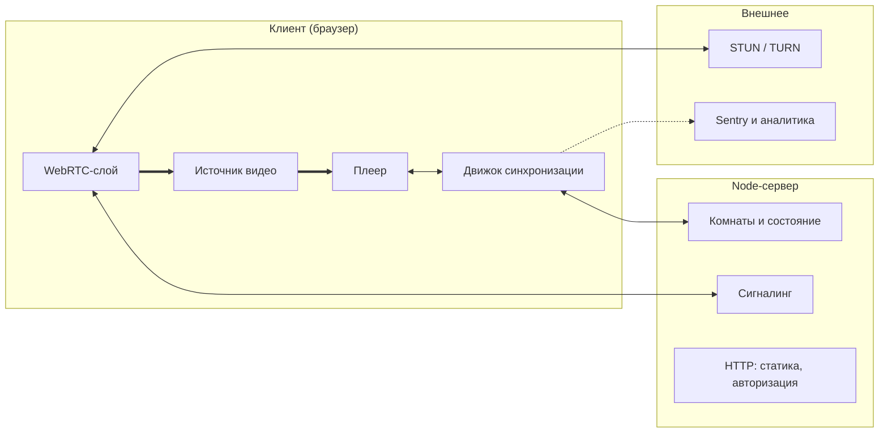
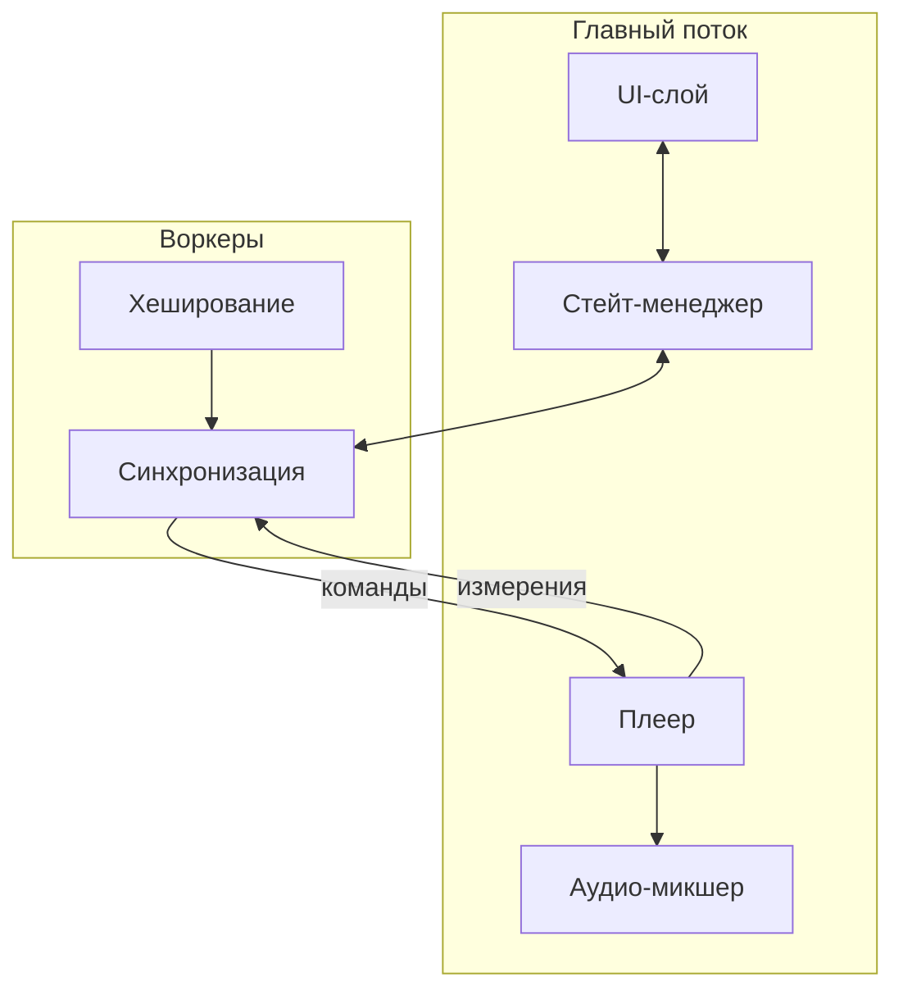
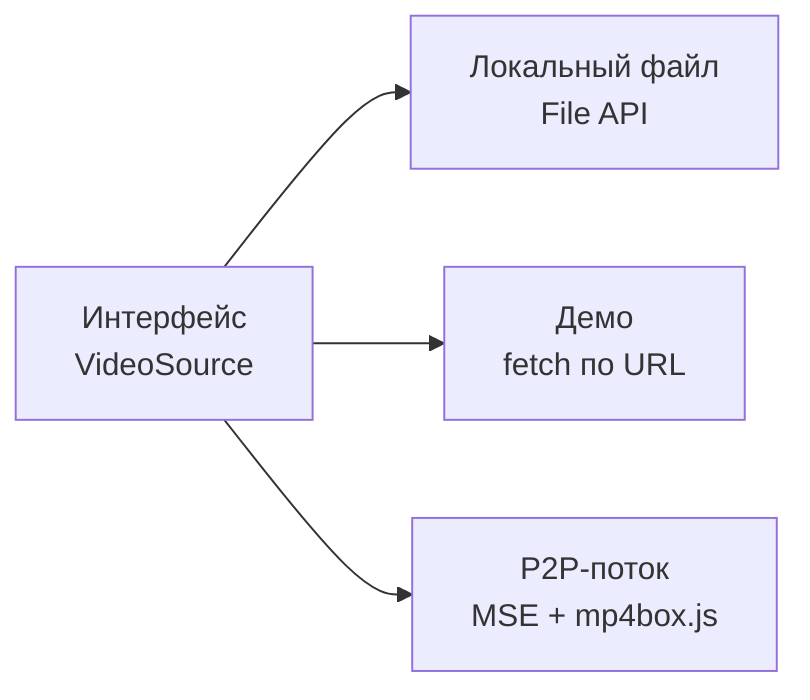

# Архитектура

Документ описывает, из чего состоит приложение и как части связаны между собой.
Читается сверху вниз: сначала система целиком, затем внутреннее устройство клиента,
затем один узел, который требует отдельного пояснения.

Здесь описана **статика** — что существует и кто с кем разговаривает.
Динамика (что происходит во времени в конкретных сценариях) вынесена
в отдельные документы, ссылки на них в конце.

---

## О чём вообще приложение

Сервис совместного просмотра видео. Несколько человек находятся в одной комнате
и смотрят одно и то же видео одновременно, общаясь голосом и в чате.

Ключевое архитектурное следствие, из которого вырастает всё остальное:
**у каждого участника свой плеер, свой файл и свой буфер**. Мы не транслируем
одну картинку всем — мы удерживаем несколько независимых плееров в одинаковом
состоянии. Поэтому основная сложность находится на клиенте, а сервер остаётся
тонким.

Второе следствие: видео мы не храним и не раздаём. Байты видео никогда
не пересекают границу клиента в сторону нашего сервера.

---

## 1. Границы системы

Самый общий уровень: что где выполняется и что между этими местами передаётся.

### Как читать

**Жирные стрелки** — это видеоданные. Обратите внимание, что обе они замкнуты
внутри рамки клиента. Ни одна жирная стрелка не идёт к серверу. Это не случайность
раскладки, а главное свойство архитектуры.

**Тонкие двусторонние стрелки** — управляющий обмен: состояние комнаты, готовность
участников, сигналинг.

**Пунктир** — телеметрия, на работу приложения не влияет.

### Блоки клиента

**Источник видео** — то, откуда берутся байты. Не один способ, а интерфейс
с несколькими реализациями; подробно в разделе 3.

**Плеер** — элемент `<video>` и обвязка вокруг него. Умеет воспроизводить,
перематывать и сообщать, какой кадр сейчас на экране.

**Движок синхронизации** — мозг приложения. Держит соединение с сервером,
оценивает расхождение часов с ним, следит за расхождением позиции воспроизведения
и корректирует его. Физически это Web Worker, не главный поток; почему именно
так — в разделе 2.

**WebRTC-слой** — прямые соединения с другими участниками: голосовой чат
и, на втором этапе, передача чанков видеофайла.

### Блоки сервера

**Комнаты и состояние** — кто в комнате, что играет, в какой позиции, кто готов.
Это единственный источник правды о состоянии воспроизведения.

**Сигналинг** — ретрансляция SDP и ICE-кандидатов между участниками.
Сервер здесь тупой посредник: он не понимает содержимого, только пересылает
адресату.

**HTTP** — раздача собранного фронтенда и авторизация.

### Чего на схеме сознательно нет

**Базы данных.** Состояние комнаты живёт в памяти процесса и умирает вместе с ним.
Комната эфемерна: она существует, пока в ней есть люди. Переживать перезапуск
сервера ей не нужно, поэтому хранилище было бы лишней сущностью.

**Медиасервера.** Видео не проходит через наши серверы ни в каком виде,
поэтому ни SFU, ни MCU, ни транскодер не требуются. Это прямое следствие решения
не хостить контент — и заодно причина, по которой проект дёшев в эксплуатации.

---

## 2. Внутреннее устройство клиента

Увеличиваем клиента и смотрим, как он разделён внутри.

### Главное, что здесь видно

Клиент разделён на два потока исполнения. В **главном потоке** живёт всё, что
касается отображения: интерфейс, состояние приложения, сам плеер, микшер звука.
В **воркерах** живёт всё, что должно работать независимо от того, смотрит ли
пользователь на вкладку.

### Почему синхронизация вынесена в воркер

Это не оптимизация, а вынужденное решение.

Браузер агрессивно экономит ресурсы на фоновых вкладках. Таймеры главного потока
в скрытой вкладке принудительно приводятся к одному срабатыванию в секунду
независимо от указанного интервала, а при длительном пребывании в фоне могут
дросселироваться ещё сильнее. Механизм `requestAnimationFrame` в скрытой вкладке
не вызывается вообще.

Контур синхронизации работает с периодом около 500 мс. В главном потоке он бы
просто останавливался, стоило пользователю переключить вкладку — а переключаются
во время просмотра постоянно. Таймеры внутри Web Worker этому дросселированию
не подвержены, поэтому и контур, и WebSocket-соединение размещены там.

### Контур «плеер ↔ синхронизация»

Две стрелки между плеером и воркером нарисованы раздельно и подписаны по-разному,
и это важно. Это не команда в одну сторону, а замкнутый контур обратной связи:

- **вниз идут команды** — подготовить позицию, стартовать в такой-то момент,
  изменить скорость воспроизведения;
- **вверх идут измерения** — какой кадр сейчас реально на экране.

Без верхней стрелки система была бы разомкнутой: мы бы отдавали команды
и не знали, выполнились ли они. Именно измерения позволяют обнаружить,
что плеер отстал, и подкрутить скорость.

Технический нюанс: измерения снимаются не через `video.currentTime`, а через
`requestVideoFrameCallback`. Причина в том, что `currentTime` — это приближение,
которое обновляется с непредсказуемой частотой и в некоторых браузерах
дополнительно округляется. Подробный разбор в документе по сценарию старта.

### Остальные блоки

**Стейт-менеджер** связывает интерфейс и воркер. UI не разговаривает с воркером
напрямую: он читает состояние из стора и отправляет туда намерения пользователя.
Это позволяет тестировать интерфейс, подменив стор, без поднятия воркера и сервера.

**Аудио-микшер** сводит две звуковые дорожки — звук фильма и голоса участников —
и приглушает первую, когда кто-то говорит. Построен на WebAudio.

**Воркер хеширования** считает отпечаток выбранного файла, чтобы убедиться,
что участники смотрят одно и то же. Вынесен в отдельный поток, потому что
файл может весить гигабайты, и считать его в главном потоке означало бы
заморозить интерфейс.

---

## 3. Источник видео

Единственный узел, который заслуживает отдельной диаграммы, потому что он
не блок, а точка расширения.

**Локальный файл** — каждый участник открывает свою копию у себя на диске.
Совпадение проверяется по отпечатку и длительности.

**Демо** — один ролик со свободной лицензией, лежащий на нашем сервере.
Нужен, чтобы приложение можно было открыть по ссылке и сразу увидеть, как оно
работает, не имея никакого файла под рукой.

**P2P-поток** — один участник раздаёт байты своего файла остальным напрямую,
минуя наш сервер. Получатели скармливают приходящие чанки в `MediaSource`
и воспроизводят у себя.

### Почему это интерфейс, а не три разных режима

Плеер и движок синхронизации ничего не знают о том, откуда взялись байты.
Для них источник — это объект с фиксированным набором методов. Благодаря этому:

- добавление нового способа получения видео не затрагивает ядро;
- в тестах источник подменяется заглушкой, и синхронизацию можно проверять
  без реальных файлов;
- самая рискованная реализация (P2P) не блокирует разработку остальных.

### Что входит в MVP

В первую версию входят **локальный файл** и **демо** — обе реализации простые
и предсказуемые. **P2P-поток** запланирован на второй этап: он требует
фрагментированного mp4 на входе, а значит ремукса в браузере, и добавляет
раздающего как единую точку отказа.

---

## 4. Протоколы

Подписи убраны со стрелок в таблицу — так они читаются лучше и не ломают
раскладку диаграмм.

| Откуда | Куда | Транспорт | Что передаётся |
|---|---|---|---|
| Воркер синхр. | WS-шлюз | WebSocket | `intent`, `state`, `presence`, `hold`, `ping`/`pong`, `chat` |
| WebRTC-слой | Сигналинг | WebSocket | SDP, ICE-кандидаты |
| WebRTC-слой | Другой участник | WebRTC media | голосовой поток |
| WebRTC-слой | Другой участник | WebRTC data | чанки видеофайла |
| Плеер | Воркер синхр. | postMessage | `mediaTime`, `expectedDisplayTime` |
| Воркер синхр. | Плеер | postMessage | `prepare`, `playAt`, `playbackRate` |
| Воркер хеш. | Воркер синхр. | postMessage | `contentHash` |
| Источник | Плеер | внутри браузера | байты видео, наружу не выходят |

Последняя строка присутствует в таблице намеренно: передача байтов — тоже поток
данных, и важно зафиксировать, что он не покидает устройство.

Детальное описание каждого сообщения и всех его полей — в `protocol.md`.

---

## 5. Технологии

| Слой | Чем реализовано |
|---|---|
| Интерфейс | React, TypeScript |
| Состояние | стейт-менеджер |
| Сборка | Vite |
| Воспроизведение | HTMLVideoElement, `requestVideoFrameCallback` |
| Фоновые вычисления | Web Worker |
| Отпечаток файла | Web Crypto |
| Сведение звука | WebAudio |
| Связь с сервером | WebSocket |
| Прямая связь между участниками | WebRTC (media + data channel) |
| Воспроизведение P2P-потока | MediaSource Extensions, mp4box.js |
| Сервер | Node.js, TypeScript |
| Запуск | Docker Compose, `make run` |

Типы сообщений протокола описаны один раз и импортируются и клиентом,
и сервером. Рассинхрон протокола становится ошибкой компиляции, а не ошибкой
времени выполнения.

---

## 6. Сценарии

Динамика вынесена в отдельные документы. Каждый разбирает один сценарий
по шагам с диаграммой последовательности.

- `sync-start.md` — одновременный старт воспроизведения
- `sync-drift.md` — обнаружение и гашение расхождения
- `sync-latejoin.md` — подключение участника к идущему просмотру
