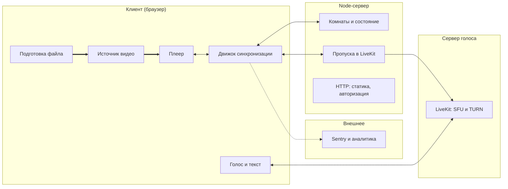
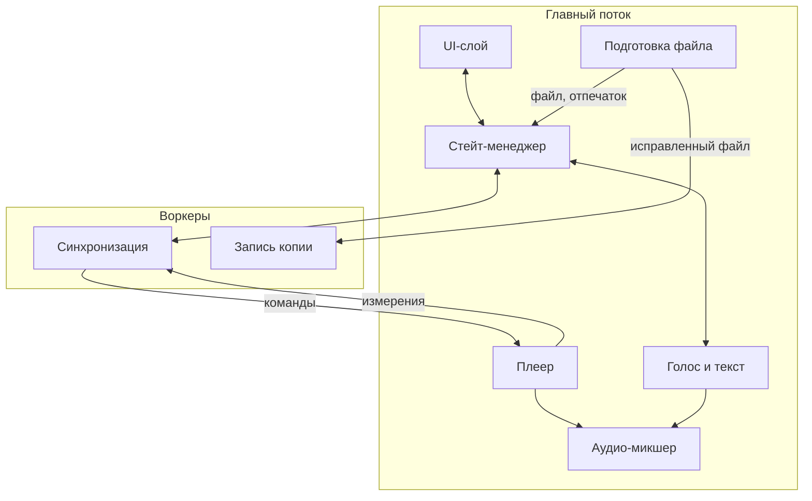
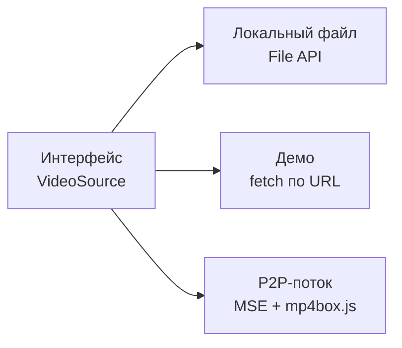

# Архитектура

Документ описывает, из чего состоит приложение и как части связаны между собой.
Читается сверху вниз: сначала система целиком, затем внутреннее устройство клиента,
затем один узел, который требует отдельного пояснения.

Здесь описана **статика** — что существует и кто с кем разговаривает.
Динамика (что происходит во времени в конкретных сценариях) вынесена
в отдельные документы, ссылки на них в конце.

---

## О чём вообще приложение

Сервис совместного просмотра видео. Несколько человек находятся в одной комнате
и смотрят одно и то же видео одновременно, общаясь голосом и в чате.

Ключевое архитектурное следствие, из которого вырастает всё остальное:
**у каждого участника свой плеер, свой файл и свой буфер**. Мы не транслируем
одну картинку всем — мы удерживаем несколько независимых плееров в одинаковом
состоянии. Поэтому основная сложность находится на клиенте, а сервер остаётся
тонким.

Второе следствие: видео мы не храним и не раздаём. Байты видео никогда
не пересекают границу клиента в сторону нашего сервера.

---

## 1. Границы системы

Самый общий уровень: что где выполняется и что между этими местами передаётся.

### Как читать

**Жирные стрелки** — это видеоданные. Обратите внимание, что они замкнуты
внутри рамки клиента. Ни одна жирная стрелка не идёт к серверу. Это не случайность
раскладки, а главное свойство архитектуры.

**Тонкие стрелки** — управляющий обмен: состояние комнаты, готовность
участников, пропуск в LiveKit. Голос и текст чата идут к серверу LiveKit
и от него, но фильм туда не попадает никогда.

**Пунктир** — телеметрия, на работу приложения не влияет.

### Блоки клиента

**Подготовка файла** — то, что происходит с файлом до входа в комнату:
проверка, будет ли звук в этом браузере, кнопка «Исправить звук» и уборка
исправленных копий. Подробно в разделах 2 и 3.

**Источник видео** — то, откуда берутся байты. Не один способ, а интерфейс
с несколькими реализациями; подробно в разделе 3.

**Плеер** — элемент `<video>` и обвязка вокруг него. Умеет воспроизводить,
перематывать и сообщать, какой кадр сейчас на экране.

**Движок синхронизации** — мозг приложения. Держит соединение с сервером,
оценивает расхождение часов с ним, следит за расхождением позиции воспроизведения
и корректирует его. Физически это Web Worker, не главный поток; почему именно
так — в разделе 2.

**Голос и текст** — библиотека `livekit-client` в главном потоке.
Публикует микрофон, принимает голоса остальных и отдаёт их в аудио-микшер,
передаёт сообщения чата. Подробно — документ A `voise-text-chats.md`.

### Блоки сервера

**Комнаты и состояние** — кто в комнате, что играет, в какой позиции, кто готов.
Это единственный источник правды о состоянии воспроизведения.

**Пропуска в LiveKit** — по запросу участника комнаты выдают ему токен
для LiveKit через уже открытый WebSocket. Через серверную библиотеку
`livekit-server-sdk` создают комнату LiveKit на время сессии и убирают
из неё ушедших. Секретный ключ LiveKit есть только у сервера.

**HTTP** — раздача собранного фронтенда и демо-ролика, авторизация.

### Сервер голоса

**LiveKit** — отдельный сервер для голоса и чата (SFU): принимает поток
от каждого участника и пересылает остальным, не смешивая и не записывая.
Встроенный TURN (его надо включить и настроить) пропускает голос и к тем,
кто за строгим NAT. В документе A — свой сервер; LiveKit Cloud на время
учёбы — предложение B, ждёт ответа A (`decisions.md`, 5.2).

### Чего на схеме сознательно нет

**Базы данных.** Состояние комнаты живёт в памяти процесса и умирает вместе с ним.
Комната эфемерна: она существует, пока в ней есть люди. Переживать перезапуск
сервера ей не нужно, поэтому хранилище было бы лишней сущностью.

**Медиасервера для фильма.** Фильмы пользователей не проходят через наши
серверы ни в каком виде, поэтому ни раздачи, ни транскодера на сервере нет.
Демо-ролик — наш собственный файл, его отдаёт HTTP как обычную статику. Это прямое следствие
решения не хостить контент — и заодно причина, по которой проект дёшев
в эксплуатации. Единственный медиасервер — LiveKit, и он только для голоса.
Звук фильма, если его надо исправить, перекодируется в браузере
у самого пользователя.

**Сигналинга P2P.** Передача файла между участниками — возможное расширение,
не MVP (раздел 3).

---

## 2. Внутреннее устройство клиента

Увеличиваем клиента и смотрим, как он разделён внутри.

### Главное, что здесь видно

Клиент разделён на два потока исполнения. В **главном потоке** живёт всё, что
касается отображения и звука: интерфейс, состояние приложения, сам плеер,
голос, микшер звука. В **воркерах** — то, что должно работать независимо
от того, смотрит ли пользователь на вкладку (синхронизация), и запись
исправленной копии фильма, которая в Safari возможна только из воркера.

### Почему синхронизация вынесена в воркер

Это не оптимизация, а вынужденное решение.

Браузер агрессивно экономит ресурсы на фоновых вкладках. Таймеры главного потока
в скрытой вкладке принудительно приводятся к одному срабатыванию в секунду
независимо от указанного интервала, а при длительном пребывании в фоне могут
дросселироваться ещё сильнее. Механизм `requestAnimationFrame` в скрытой вкладке
не вызывается вообще.

Контур синхронизации принимает решение каждые 100 мс. В главном потоке он бы
просто останавливался, стоило пользователю переключить вкладку — а переключаются
во время просмотра постоянно. Таймеры выделенного воркера не дросселируются ни
в одном из трёх движков: в Chrome флаг `BlinkSchedulerWorkerThrottling` выключен
по умолчанию, в Firefox троттлинг воркеров включён только в Nightly, в WebKit
в коде прямо написано «We don't throttle timers in worker threads». Поэтому
и контур, и WebSocket-соединение размещены там.

Воркер не спасает от всего. Измерения приходят из главного потока через
`requestVideoFrameCallback`, а он в скрытой вкладке Chrome и Firefox молчит.
На этот случай воркер сам опрашивает `currentTime`: сообщения между воркером
и окном доставляются мгновенно даже в фоне (проверено в прототипе). А если
браузер заморозит вкладку целиком (Chrome в режиме энергосбережения, iOS при
сворачивании), встанет и воркер — после возврата нужна полная
ресинхронизация. Звучащие вкладки и вкладки с активным WebRTC Chrome
не замораживает, так что голосовой чат дополнительно защищает от этого.

У воркера и окна разные точки отсчёта `performance.now()`: у окна — начало
загрузки страницы, у воркера — момент его создания. Воркер измеряет разницу
обменом сообщениями, как и смещение до сервера, и переводит все метки
главного потока в свою шкалу.

### Контур «плеер ↔ синхронизация»

Две стрелки между плеером и воркером нарисованы раздельно и подписаны по-разному,
и это важно. Это не команда в одну сторону, а замкнутый контур обратной связи:

- **вниз идут команды** — подготовить позицию, стартовать в такой-то момент,
  изменить скорость воспроизведения;
- **вверх идут измерения** — какой кадр сейчас реально на экране.

Без верхней стрелки система была бы разомкнутой: мы бы отдавали команды
и не знали, выполнились ли они. Именно измерения позволяют обнаружить,
что плеер отстал, и подкрутить скорость.

Технический нюанс: измерения снимаются не через `video.currentTime`, а через
`requestVideoFrameCallback`. Причина в том, что `currentTime` — это приближение,
которое обновляется с непредсказуемой частотой: в Chrome оно идёт по звуковым
часам и двигается ступеньками. Подробный разбор в `sync-drift.md`.

### Остальные блоки

**Стейт-менеджер** связывает интерфейс и воркер. UI не разговаривает с воркером
напрямую: он читает состояние из стора и отправляет туда намерения пользователя.
Это позволяет тестировать интерфейс, подменив стор, без поднятия воркера и сервера.

**Голос и текст** — `livekit-client`. Токен для LiveKit запрашивает через
стор и воркер по уже открытому WebSocket. Каждый входящий голос отдаёт
в микшер, а не играет сам: у каждого голоса ровно один слышимый путь
(документ A, раздел 7.1).

**Аудио-микшер** сводит звук фильма и голоса участников.
Построен на WebAudio и делает три вещи:

- приглушает фильм, когда кто-то говорит (`GainNode` на дорожке фильма);
- задерживает голос того собеседника, который смотрит впереди слушателя
  больше чем на 250 мс (`DelayNode` на каждого собеседника, подробно
  в `sync-latejoin.md` и `decisions.md`, 5.1);
- выключает звук фильма по кнопке — **громкостью, а не `muted`**. Скрытую
  вкладку с видео, которое было беззвучным с самого начала, Chrome ставит
  на паузу (проверено в прототипе), и участник теряет всё время, пока смотрел
  в другую вкладку.

Микшер ничего не сообщает остальной системе. Задержку каждого голоса
он считает сам по отклонениям участников из стора (`presence:sync`).

**Подготовка файла** — всё, что происходит между «выбрал файл» и «вошёл
в комнату»:
- **отпечаток** — размер и SHA-256 трёх кусков по 1 МиБ: начало, середина,
  конец (спайк C, `decisions.md`, 6.1). Считается прямо в главном потоке:
  чтение файла и SHA-256 в браузере асинхронные и страницу не замораживают,
  а три куска на файле 4,18 ГиБ заняли 7–20 мс. Полный хеш браузер посчитать
  не может: `crypto.subtle.digest` принимает данные только целиком,
  потокового режима нет (w3c/webcrypto#73);
- **проверка звука** — прогноз по контейнеру и кодекам, затем короткое
  беззвучное проигрывание (раздел 3);
- **«Исправить звук»** — по кнопке, если звука не будет. Библиотека
  Mediabunny читает файл по кускам, копирует видео без изменений,
  перекодирует выбранную звуковую дорожку и отдаёт куски результата
  **воркеру записи копии**. Тот пишет MP4 в хранилище браузера (OPFS):
  синхронная запись в файл OPFS есть во всех трёх браузерах, но только
  в воркере, а асинхронной в Safari 18 нет. Гигабайты не держатся в памяти.
  Mediabunny с расширениями — около 5 МБ, загружается только по кнопке.

---

## 3. Источник видео

Единственный узел, который заслуживает отдельной диаграммы, потому что он
не блок, а точка расширения.

**Локальный файл** — каждый участник открывает свою копию у себя на диске.
Совпадение проверяется по отпечатку и длительности. Если звук пришлось
исправлять, играет исправленная копия из хранилища браузера, а отпечаток
остаётся от исходного файла.

**Демо** — один ролик со свободной лицензией, лежащий на нашем сервере.
Нужен, чтобы приложение можно было открыть по ссылке и сразу увидеть, как оно
работает, не имея никакого файла под рукой.

**P2P-поток** — один участник раздаёт байты своего файла остальным напрямую,
минуя наш сервер. Получатели скармливают приходящие чанки в `MediaSource`
и воспроизводят у себя.

### Почему это интерфейс, а не три разных режима

Плеер и движок синхронизации ничего не знают о том, откуда взялись байты.
Для них источник — это объект с фиксированным набором методов. Благодаря этому:

- добавление нового способа получения видео не затрагивает ядро;
- в тестах источник подменяется заглушкой, и синхронизацию можно проверять
  без реальных файлов;
- самая рискованная реализация (P2P) не блокирует разработку остальных.

### Что входит в MVP

В первую версию входят **локальный файл** и **демо** — обе реализации простые
и предсказуемые, и на них команда коммитится.

**P2P-поток — возможное расширение, а не обязательство.** Интерфейс источника
позволяет добавить его без переделки ядра, но риски высокие и пока не
проверены на прототипе:

- MSE принимает только фрагментированный MP4 или WebM, а обычный файл
  нужно переупаковать в браузере (mp4box.js умеет это только для MP4, не MKV);
- звук AC-3, E-AC-3 и DTS браузеры не декодируют, и MSE этого не исправляет;
- раздающий — единая точка отказа, и его исходящего канала может не хватить
  на троих.

Через LiveKit P2P не сделать: у него нет прямых соединений, весь фильм
пошёл бы через сервер. Нужны свои соединения WebRTC и свой сигналинг
(`decisions.md`, 1.3). Решение, делать ли этот этап, принимается после G4.

### Какие файлы вообще будут играть

Это главный риск локального режима. Скачанные фильмы часто лежат в MKV
со звуком Dolby (AC-3, E-AC-3) или DTS. Замерено на 13 роликах
(`spikes/media-compat.md`):

| Звук в файле | Chrome 154 | Firefox 157 | Safari 18.6 |
|---|---|---|---|
| AC-3, E-AC-3, DTS в MKV | **без звука**, без ошибки | **без звука**, без ошибки | MKV не открывается |
| AAC в MKV | есть | есть | MKV не открывается |
| AC-3, E-AC-3 в MP4 | без звука | без звука | есть |
| AAC в MP4 | есть | есть | есть |

Chromium пропускает дорожки, которые не умеет декодировать, и играет
остальные (`media/filters/ffmpeg_demuxer.cc`: «Unsupported streams are
skipped, allowing for partial playback»). Поэтому после выбора файла
клиент проверяет, будет ли звук: сначала по правилам из замеров
(контейнер и кодек), затем коротким беззвучным проигрыванием —
Chrome сообщает о декодированном звуке (`webkitAudioDecodedByteCount`),
Firefox — о наличии звука (`mozHasAudio`). Safari такого не сообщает,
там остаётся прогноз.

Если звука не будет, участнику предлагается **«Исправить звук»**
(`decisions.md`, 6.3): видео копируется как есть, звук перекодируется
в кодек этого браузера, результат — MP4 в хранилище браузера. В прототипе
синтетический двухчасовой фильм 720p на двух ядрах в Chromium переделывается
за 3,2–8,2 минуты; настоящие фильмы на 4–8 ГБ и Safari не мерили.
Safari MKV не открывает, но MP4 с AAC играет — поэтому ожидаем, что
исправленный файл заработает и там; в Safari прототип ещё не запускали.
Исправлять не обязательно: можно смотреть без звука фильма.

Копия фильма — это 2–8 ГБ на диске пользователя, поэтому приложение
предупреждает о ней заранее, хранит одну копию, удаляет копию, которую
не открывали 7 дней, и даёт кнопку удаления в настройках (`decisions.md`, 6.5).

Демо-ролик раздаётся как WebM (VP9 + Opus) с того же адреса, что и приложение:
так он играет везде, включая сборки Chromium без проприетарных кодеков,
и не даёт тишины при подключении к WebAudio.

---

## 4. Протоколы

Подписи убраны со стрелок в таблицу — так они читаются лучше и не ломают
раскладку диаграмм.

| Откуда | Куда | Транспорт | Что передаётся |
|---|---|---|---|
| Воркер синхр. | WS-шлюз | WebSocket | `room`, `source`, `intent`, `state`, `presence`, `hold`, `ping`/`pong`, `media:token` |
| Голос и текст | LiveKit | WSS и WebRTC | сигналинг LiveKit, голос, текст чата |
| Сервер | LiveKit | HTTP API (`livekit-server-sdk`) | создание комнат, удаление участников |
| Подготовка файла | Стор → воркер синхр. | postMessage | отпечаток, длительность, имя файла |
| Подготовка файла | Воркер записи копии | postMessage | куски исправленного файла |
| Плеер | Воркер синхр. | postMessage | `mediaTime`, `expectedDisplayTime` |
| Воркер синхр. | Плеер | postMessage | `prepare`, `playAt`, `playbackRate` |
| Источник | Плеер | внутри браузера | байты видео, наружу не выходят |

Последняя строка присутствует в таблице намеренно: передача байтов — тоже поток
данных, и важно зафиксировать, что он не покидает устройство.

Детальное описание каждого сообщения и всех его полей — в `protocol.md`.

---

## 5. Технологии

Версии — актуальные на конец сентября 2026. Строки с пометкой «решает
команда» ещё не согласованы.

| Слой | Чем реализовано | Почему |
|---|---|---|
| Язык | TypeScript **~6.0** | `npm i typescript` сейчас ставит 7.0, с которой не работает typescript-eslint (поддержка `<6.1.0`). Версию нужно закрепить |
| Интерфейс | React 19 | |
| Компоненты | MUI 9 или antd 6 — решает команда | требование курса |
| Состояние | Redux Toolkit 2 | Redux явно назван в требованиях курса; события воркера естественно ложатся в экшены, и в Redux DevTools виден весь ход синхронизации |
| Сборка | Vite 8 | воркер подключается как `new Worker(new URL('./sync.worker.ts', import.meta.url), { type: 'module' })` |
| Воспроизведение | HTMLVideoElement, `requestVideoFrameCallback` | точная пара «кадр — момент показа» |
| Фоновые вычисления | Web Worker | синхронизация; запись исправленной копии |
| Отпечаток файла | Web Crypto: SHA-256 трёх кусков по 1 МиБ | требование курса; полный хеш невозможен |
| Исправление звука | Mediabunny 1.x с расширениями `@mediabunny/ac3`, `dts`, `aac-encoder` | MPL-2.0, расширения на FFmpeg (LGPL); ~5 МБ, грузится только по кнопке |
| Хранилище копий | OPFS, запись через `createSyncAccessHandle` в воркере | единственный способ писать в файл во всех трёх браузерах, включая Safari 18 |
| Сведение звука | WebAudio: `GainNode`, `DelayNode` | требование курса |
| Голос и текстовый чат | LiveKit: `livekit-client`, `livekit-server-sdk`, LiveKit Server; микрофон через `getUserMedia` | SFU со встроенным TURN; микрофон требует HTTPS |
| Связь с сервером | WebSocket | |
| Проверка сообщений | zod 4, схемы в `shared/` | сервер проверяет каждое входящее сообщение, типы выводятся из схем |
| P2P-поток (не в MVP) | WebRTC, MSE, mp4box.js | см. раздел 3 |
| Сервер | Node.js 24 LTS, библиотека `ws` 8 | Node 24 исполняет TypeScript сам (снятие типов), без сборки. Нужны `erasableSyntaxOnly` и расширения `.ts` в импортах, запрещены `enum` |
| Unit-тесты | Vitest 5, покрытие v8, порог 80 % | в `coverage.include` явно перечислить папки, иначе считаются только импортированные файлы |
| e2e | Playwright 1.63 | в его Chromium нет H.264/AAC, поэтому тестовое видео — WebM |
| Ошибки | Sentry или GlitchTip | Sentry блокировал российские аккаунты; GlitchTip совместим с SDK Sentry. Уточнить у преподавателя |
| Аналитика | Яндекс Метрика — решает команда | |
| Запуск | Docker Compose, `make run`, образ `node:24-alpine` | образ мультиархитектурный, работает на Apple Silicon без эмуляции |
| Сервер голоса | LiveKit Server в том же Docker Compose (документ A) или LiveKit Cloud на время учёбы — ждёт ответа A | своему нужны публичный IP, UDP 50000–60000 и 3478, TCP 7881, TURN на 443 или 5349, порт 7880 за прокси с HTTPS, домен и настоящий сертификат |

Типы сообщений протокола описаны один раз в `shared/` и импортируются
и клиентом, и сервером. Рассинхрон протокола становится ошибкой компиляции,
а не ошибкой времени выполнения.

---

## 6. Что проверено на прототипе

Ядро синхронизации собрано и измерено в прототипе до того, как
архитектура зафиксирована. Прототип лежит в отдельной ветке `spike/sync`
(папка `spikes/sync/`) и в продукт не входит. Подробности и таблицы —
в `sync-drift.md` и `spikes/sync/README.md` в той ветке.

- Две вкладки стартуют с расхождением до 17 мс (повторный старт — до 83 мс,
  дальше контур дотягивает) и держатся в пределах 4–35 мс (95-й перцентиль, зависит от прогона —
  машина для замеров слабая, на ноутбуках перемерить).
- При круговой задержке 120 мс синхронизация не хуже, чем без неё:
  оценка часов задержку компенсирует.
- Новичок входит в играющую комнату за ~1 с, комната не останавливается.
- Сбой на 900 мс гасится одной перемоткой за 2–6 с.
- В скрытой вкладке контур продолжает работать через опрос `currentTime`.
- `performance.now()` воркера и окна расходятся на 45–95 мс: без моста
  между шкалами вся ошибка была бы сдвинута на эту величину.

Ещё два спайка:

- **Звук скачанных фильмов** (`spikes/media-compat.md`): 13 роликов
  в Chrome 154, Firefox 157 и Safari 18.6; прототип «Исправить звук»
  в Chromium — синтетический двухчасовой фильм 720p за 3,2–8,2 минуты на двух
  ядрах, время первого кадра совпадает с исходником, недописанный файл
  удаляется при отмене.
- **Отпечаток файла** (C, ветка `spike/file-fingerprint`): три куска
  по 1 МиБ на файле 4,18 ГиБ — 7–10 мс в Chrome и 11–20 мс в Safari
  на чтение и SHA-256; отпечатки в двух браузерах совпали.

---

## 7. Известные риски

| Риск | Что с ним делаем |
|---|---|
| Звук AC-3/DTS не играет, ошибки нет | проверка звука после выбора файла, «Исправить звук» в браузере |
| Исправленные копии копятся на диске | предупреждение до исправления, одна копия, удаление через 7 дней, кнопка в настройках |
| Сервер LiveKit недоступен | просмотр продолжается, голос и чат пропадают; переподключение — в SDK |
| Обрыв Wi-Fi выбрасывает из комнаты и рвёт голос | место держится 30 секунд, возвращение по токену сессии (предложено) |
| Safari замирает при каждой смене `playbackRate` | в Safari только перемотки |
| Chrome игнорирует скорость в пределах ±0.1 % | минимальный шаг коррекции 0.3 % |
| Скрытая вкладка: нет кадров rVFC | опрос `currentTime` из воркера |
| Скрытая вкладка: беззвучное видео ставится на паузу | звук выключается громкостью, не `muted` |
| Скрытая вкладка: видео не начинает грузиться | у барьера есть дедлайн; в списке участников видно, кто не готов |
| Асимметричная сеть сдвигает часы незаметно для клиента | принимаем как ограничение, показываем отклонение в списке участников |
| Bluetooth-наушники запаздывают, и браузер может этого не знать | ручная поправка задержки в настройках |
| `typescript@latest` ломает линтер | версия закреплена `~6.0` |
| Бесплатный хостинг засыпает и рвёт WebSocket; часть зарубежных площадок медленно открывается из России | российский VPS с тем же Docker Compose |
| Ветка с защитой: в приватном репозитории бесплатной организации её нет | репозиторий публичный — ограничение не касается |

---

## 8. Сценарии

Динамика вынесена в отдельные документы. Каждый разбирает один сценарий
по шагам с диаграммой последовательности.

- `sync-start.md` — одновременный старт воспроизведения
- `sync-drift.md` — обнаружение и гашение расхождения
- `sync-latejoin.md` — подключение участника к идущему просмотру

Описание сообщений — `protocol.md`. Голос и текстовый чат —
`voise-text-chats.md` (документ A). Прототип и замеры — ветка `spike/sync`,
папка `spikes/sync/`; звук фильмов — `spikes/media-compat.md`.
