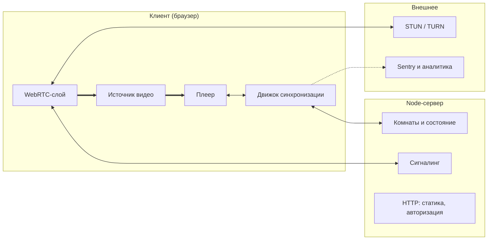
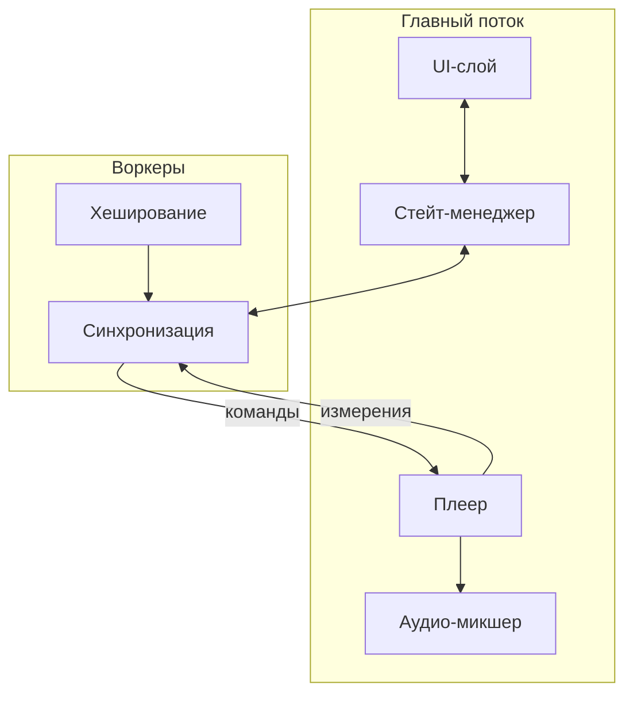
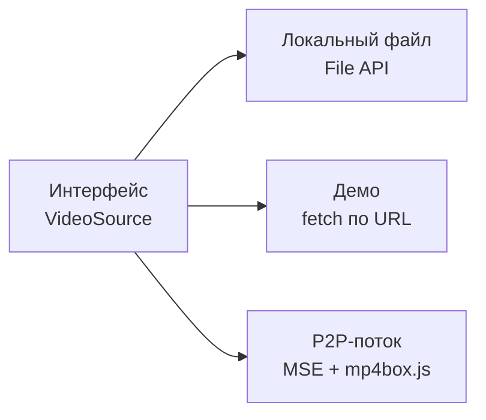

# Архитектура

Документ описывает, из чего состоит приложение и как части связаны между собой.
Читается сверху вниз: сначала система целиком, затем внутреннее устройство клиента,
затем один узел, который требует отдельного пояснения.

Здесь описана **статика** — что существует и кто с кем разговаривает.
Динамика (что происходит во времени в конкретных сценариях) вынесена
в отдельные документы, ссылки на них в конце.

---

## О чём вообще приложение

Сервис совместного просмотра видео. Несколько человек находятся в одной комнате
и смотрят одно и то же видео одновременно, общаясь голосом и в чате.

Ключевое архитектурное следствие, из которого вырастает всё остальное:
**у каждого участника свой плеер, свой файл и свой буфер**. Мы не транслируем
одну картинку всем — мы удерживаем несколько независимых плееров в одинаковом
состоянии. Поэтому основная сложность находится на клиенте, а сервер остаётся
тонким.

Второе следствие: видео мы не храним и не раздаём. Байты видео никогда
не пересекают границу клиента в сторону нашего сервера.

---

## 1. Границы системы

Самый общий уровень: что где выполняется и что между этими местами передаётся.

### Как читать

**Жирные стрелки** — это видеоданные. Обратите внимание, что обе они замкнуты
внутри рамки клиента. Ни одна жирная стрелка не идёт к серверу. Это не случайность
раскладки, а главное свойство архитектуры.

**Тонкие двусторонние стрелки** — управляющий обмен: состояние комнаты, готовность
участников, сигналинг.

**Пунктир** — телеметрия, на работу приложения не влияет.

### Блоки клиента

**Источник видео** — то, откуда берутся байты. Не один способ, а интерфейс
с несколькими реализациями; подробно в разделе 3.

**Плеер** — элемент `<video>` и обвязка вокруг него. Умеет воспроизводить,
перематывать и сообщать, какой кадр сейчас на экране.

**Движок синхронизации** — мозг приложения. Держит соединение с сервером,
оценивает расхождение часов с ним, следит за расхождением позиции воспроизведения
и корректирует его. Физически это Web Worker, не главный поток; почему именно
так — в разделе 2.

**WebRTC-слой** — прямые соединения с другими участниками: голосовой чат
и, на втором этапе, передача чанков видеофайла.

### Блоки сервера

**Комнаты и состояние** — кто в комнате, что играет, в какой позиции, кто готов.
Это единственный источник правды о состоянии воспроизведения.

**Сигналинг** — ретрансляция SDP и ICE-кандидатов между участниками.
Сервер здесь тупой посредник: он не понимает содержимого, только пересылает
адресату.

**HTTP** — раздача собранного фронтенда и авторизация.

### Чего на схеме сознательно нет

**Базы данных.** Состояние комнаты живёт в памяти процесса и умирает вместе с ним.
Комната эфемерна: она существует, пока в ней есть люди. Переживать перезапуск
сервера ей не нужно, поэтому хранилище было бы лишней сущностью.

**Медиасервера.** Видео не проходит через наши серверы ни в каком виде,
поэтому ни SFU, ни MCU, ни транскодер не требуются. Это прямое следствие решения
не хостить контент — и заодно причина, по которой проект дёшев в эксплуатации.

---

## 2. Внутреннее устройство клиента

Увеличиваем клиента и смотрим, как он разделён внутри.

### Главное, что здесь видно

Клиент разделён на два потока исполнения. В **главном потоке** живёт всё, что
касается отображения: интерфейс, состояние приложения, сам плеер, микшер звука.
В **воркерах** живёт всё, что должно работать независимо от того, смотрит ли
пользователь на вкладку.

### Почему синхронизация вынесена в воркер

Это не оптимизация, а вынужденное решение.

Браузер агрессивно экономит ресурсы на фоновых вкладках. Таймеры главного потока
в скрытой вкладке принудительно приводятся к одному срабатыванию в секунду
независимо от указанного интервала, а при длительном пребывании в фоне могут
дросселироваться ещё сильнее. Механизм `requestAnimationFrame` в скрытой вкладке
не вызывается вообще.

Контур синхронизации принимает решение каждые 100 мс. В главном потоке он бы
просто останавливался, стоило пользователю переключить вкладку — а переключаются
во время просмотра постоянно. Таймеры выделенного воркера не дросселируются ни
в одном из трёх движков: в Chrome флаг `BlinkSchedulerWorkerThrottling` выключен
по умолчанию, в Firefox троттлинг воркеров включён только в Nightly, в WebKit
в коде прямо написано «We don't throttle timers in worker threads». Поэтому
и контур, и WebSocket-соединение размещены там.

Воркер не спасает от всего. Измерения приходят из главного потока через
`requestVideoFrameCallback`, а он в скрытой вкладке Chrome и Firefox молчит.
На этот случай воркер сам опрашивает `currentTime`: сообщения между воркером
и окном доставляются мгновенно даже в фоне (проверено в прототипе). А если
браузер заморозит вкладку целиком (Chrome в режиме энергосбережения, iOS при
сворачивании), встанет и воркер — после возврата нужна полная
ресинхронизация. Звучащие вкладки и вкладки с активным WebRTC Chrome
не замораживает, так что голосовой чат дополнительно защищает от этого.

У воркера и окна разные точки отсчёта `performance.now()`: у окна — начало
загрузки страницы, у воркера — момент его создания. Воркер измеряет разницу
обменом сообщениями, как и смещение до сервера, и переводит все метки
главного потока в свою шкалу.

### Контур «плеер ↔ синхронизация»

Две стрелки между плеером и воркером нарисованы раздельно и подписаны по-разному,
и это важно. Это не команда в одну сторону, а замкнутый контур обратной связи:

- **вниз идут команды** — подготовить позицию, стартовать в такой-то момент,
  изменить скорость воспроизведения;
- **вверх идут измерения** — какой кадр сейчас реально на экране.

Без верхней стрелки система была бы разомкнутой: мы бы отдавали команды
и не знали, выполнились ли они. Именно измерения позволяют обнаружить,
что плеер отстал, и подкрутить скорость.

Технический нюанс: измерения снимаются не через `video.currentTime`, а через
`requestVideoFrameCallback`. Причина в том, что `currentTime` — это приближение,
которое обновляется с непредсказуемой частотой: в Chrome оно идёт по звуковым
часам и двигается ступеньками. Подробный разбор в `sync-drift.md`.

### Остальные блоки

**Стейт-менеджер** связывает интерфейс и воркер. UI не разговаривает с воркером
напрямую: он читает состояние из стора и отправляет туда намерения пользователя.
Это позволяет тестировать интерфейс, подменив стор, без поднятия воркера и сервера.

**Аудио-микшер** сводит две звуковые дорожки — звук фильма и голоса участников.
Построен на WebAudio и делает три вещи:

- приглушает фильм, когда кто-то говорит (`GainNode` на дорожке фильма);
- задерживает входящие голоса, если участник отстал от комнаты больше чем
  на 250 мс (`DelayNode` на каждого собеседника, подробно в `sync-latejoin.md`);
- выключает звук фильма по кнопке — **громкостью, а не `muted`**. Скрытую
  вкладку с видео, которое было беззвучным с самого начала, Chrome ставит
  на паузу (проверено в прототипе), и участник теряет всё время, пока смотрел
  в другую вкладку.

Микшер ничего не сообщает остальной системе: величину задержки и уровень
приглушения ему задаёт воркер синхронизации.

**Воркер хеширования** считает отпечаток выбранного файла, чтобы убедиться,
что участники смотрят одно и то же. Полный хеш многогигабайтного файла
браузер посчитать не может: `crypto.subtle.digest` принимает данные только
целиком, потокового режима нет (w3c/webcrypto#73). Поэтому отпечаток
собирается из размера файла и SHA-256 от 33 кусочков по 1 МиБ, взятых
равномерно от начала до конца файла. Идея та же, что у хеша OpenSubtitles.
Длительность сравнивается отдельно, с допуском около секунды:
разные браузеры сообщают её для одного файла по-разному. Работа вынесена
в поток, чтобы чтение с диска не замораживало интерфейс.

---

## 3. Источник видео

Единственный узел, который заслуживает отдельной диаграммы, потому что он
не блок, а точка расширения.

**Локальный файл** — каждый участник открывает свою копию у себя на диске.
Совпадение проверяется по отпечатку и длительности.

**Демо** — один ролик со свободной лицензией, лежащий на нашем сервере.
Нужен, чтобы приложение можно было открыть по ссылке и сразу увидеть, как оно
работает, не имея никакого файла под рукой.

**P2P-поток** — один участник раздаёт байты своего файла остальным напрямую,
минуя наш сервер. Получатели скармливают приходящие чанки в `MediaSource`
и воспроизводят у себя.

### Почему это интерфейс, а не три разных режима

Плеер и движок синхронизации ничего не знают о том, откуда взялись байты.
Для них источник — это объект с фиксированным набором методов. Благодаря этому:

- добавление нового способа получения видео не затрагивает ядро;
- в тестах источник подменяется заглушкой, и синхронизацию можно проверять
  без реальных файлов;
- самая рискованная реализация (P2P) не блокирует разработку остальных.

### Что входит в MVP

В первую версию входят **локальный файл** и **демо** — обе реализации простые
и предсказуемые, и на них команда коммитится.

**P2P-поток — возможное расширение, а не обязательство.** Интерфейс источника
позволяет добавить его без переделки ядра, но риски высокие и пока не
проверены на прототипе:

- MSE принимает только фрагментированный MP4 или WebM, а обычный файл
  нужно переупаковать в браузере (mp4box.js умеет это только для MP4, не MKV);
- звук AC-3, E-AC-3 и DTS браузеры не декодируют, и MSE этого не исправляет;
- раздающий — единая точка отказа, и его исходящего канала может не хватить
  на троих.

Решение, делать ли этот этап, принимается после G4.

### Какие файлы вообще будут играть

Это главный риск локального режима. Типичный скачанный фильм — MKV с видео
H.264/HEVC и звуком AC-3, E-AC-3 или DTS. Что с ним происходит:

| Браузер | Результат |
|---|---|
| Chrome | играет **без звука**, без какой-либо ошибки |
| Firefox 145+ | играет **без звука** |
| Edge (Windows) | со звуком для AC-3/E-AC-3, без звука для DTS; зависит от машины |
| Safari | MKV не открывается вообще |

Chromium пропускает дорожки, которые не умеет декодировать, и играет
остальные (`media/filters/ffmpeg_demuxer.cc`: «Unsupported streams are
skipped, allowing for partial playback»). Поэтому после выбора файла
клиент проверяет, есть ли звук на самом деле (`webkitAudioDecodedByteCount`
в Chrome, `mozHasAudio` в Firefox, `audioTracks` в Safari), и честно
предупреждает участника до входа в комнату.

Демо-ролик раздаётся как WebM (VP9 + Opus) с того же адреса, что и приложение:
так он играет везде, включая сборки Chromium без проприетарных кодеков,
и не даёт тишины при подключении к WebAudio.

---

## 4. Протоколы

Подписи убраны со стрелок в таблицу — так они читаются лучше и не ломают
раскладку диаграмм.

| Откуда | Куда | Транспорт | Что передаётся |
|---|---|---|---|
| Воркер синхр. | WS-шлюз | WebSocket | `intent`, `state`, `presence`, `hold`, `ping`/`pong`, `chat` |
| WebRTC-слой | Сигналинг | WebSocket | SDP, ICE-кандидаты |
| WebRTC-слой | Другой участник | WebRTC media | голосовой поток |
| WebRTC-слой | Другой участник | WebRTC data | чанки видеофайла |
| Плеер | Воркер синхр. | postMessage | `mediaTime`, `expectedDisplayTime` |
| Воркер синхр. | Плеер | postMessage | `prepare`, `playAt`, `playbackRate` |
| Воркер хеш. | Воркер синхр. | postMessage | `contentHash` |
| Источник | Плеер | внутри браузера | байты видео, наружу не выходят |

Последняя строка присутствует в таблице намеренно: передача байтов — тоже поток
данных, и важно зафиксировать, что он не покидает устройство.

Детальное описание каждого сообщения и всех его полей — в `protocol.md`.

---

## 5. Технологии

Версии — актуальные на конец сентября 2026. Строки с пометкой «решает
команда» ещё не согласованы.

| Слой | Чем реализовано | Почему |
|---|---|---|
| Язык | TypeScript **~6.0** | `npm i typescript` сейчас ставит 7.0, с которой не работает typescript-eslint (поддержка `<6.1.0`). Версию нужно закрепить |
| Интерфейс | React 19 | |
| Компоненты | MUI 9 или antd 6 — решает команда | требование курса |
| Состояние | Redux Toolkit 2 (рекомендация) или Effector — решает команда | Redux явно назван в требованиях курса; события воркера естественно ложатся в экшены, и в Redux DevTools виден весь ход синхронизации |
| Сборка | Vite 8 | воркер подключается как `new Worker(new URL('./sync.worker.ts', import.meta.url), { type: 'module' })` |
| Воспроизведение | HTMLVideoElement, `requestVideoFrameCallback` | точная пара «кадр — момент показа» |
| Фоновые вычисления | Web Worker ×2 | синхронизация и хеширование |
| Отпечаток файла | Web Crypto (SHA-256 по фрагментам) | требование курса; полный хеш невозможен |
| Сведение звука | WebAudio: `GainNode`, `DelayNode` | требование курса |
| Голос | MediaCapture (`getUserMedia`) + WebRTC | требует HTTPS |
| Связь с сервером | WebSocket | |
| Проверка сообщений | zod 4, схемы в `shared/` | сервер проверяет каждое входящее сообщение, типы выводятся из схем |
| Прямая связь | WebRTC; STUN публичный, TURN не в MVP | |
| P2P-поток (не в MVP) | MSE, mp4box.js | см. раздел 3 |
| Сервер | Node.js 24 LTS, библиотека `ws` 8 | Node 24 исполняет TypeScript сам (снятие типов), без сборки. Нужны `erasableSyntaxOnly` и расширения `.ts` в импортах, запрещены `enum` |
| Unit-тесты | Vitest 5, покрытие v8, порог 80 % | в `coverage.include` явно перечислить папки, иначе считаются только импортированные файлы |
| e2e | Playwright 1.63 | в его Chromium нет H.264/AAC, поэтому тестовое видео — WebM |
| Ошибки | Sentry или GlitchTip | Sentry блокировал российские аккаунты; GlitchTip совместим с SDK Sentry. Уточнить у преподавателя |
| Аналитика | Яндекс Метрика — решает команда | |
| Запуск | Docker Compose, `make run`, образ `node:24-alpine` | образ мультиархитектурный, работает на Apple Silicon без эмуляции |

Типы сообщений протокола описаны один раз в `shared/` и импортируются
и клиентом, и сервером. Рассинхрон протокола становится ошибкой компиляции,
а не ошибкой времени выполнения.

---

## 6. Что проверено на прототипе

Ядро синхронизации собрано и измерено в прототипе до того, как
архитектура зафиксирована. Прототип лежит в отдельной ветке `spike/sync`
(папка `spikes/sync/`) и в продукт не входит. Подробности и таблицы —
в `sync-drift.md` и `spikes/sync/README.md` в той ветке.

- Две вкладки стартуют с расхождением до 17 мс (повторный старт — до 83 мс,
  дальше контур дотягивает) и держатся в пределах 4–35 мс (95-й перцентиль, зависит от прогона —
  машина для замеров слабая, на ноутбуках перемерить).
- При круговой задержке 120 мс синхронизация не хуже, чем без неё:
  оценка часов задержку компенсирует.
- Новичок входит в играющую комнату за ~1 с, комната не останавливается.
- Сбой на 900 мс гасится одной перемоткой за 2–6 с.
- В скрытой вкладке контур продолжает работать через опрос `currentTime`.
- `performance.now()` воркера и окна расходятся на 45–95 мс: без моста
  между шкалами вся ошибка была бы сдвинута на эту величину.

---

## 7. Известные риски

| Риск | Что с ним делаем |
|---|---|
| Звук AC-3/DTS не играет, ошибки нет | проверка звука после выбора файла, предупреждение до входа |
| Safari замирает при каждой смене `playbackRate` | в Safari только перемотки |
| Chrome игнорирует скорость в пределах ±0.1 % | минимальный шаг коррекции 0.3 % |
| Скрытая вкладка: нет кадров rVFC | опрос `currentTime` из воркера |
| Скрытая вкладка: беззвучное видео ставится на паузу | звук выключается громкостью, не `muted` |
| Скрытая вкладка: видео не начинает грузиться | у барьера есть дедлайн; в списке участников видно, кто не готов |
| Асимметричная сеть сдвигает часы незаметно для клиента | принимаем как ограничение, показываем отклонение в списке участников |
| Bluetooth-наушники запаздывают, и браузер может этого не знать | ручная поправка задержки в настройках |
| `typescript@latest` ломает линтер | версия закреплена `~6.0` |
| Бесплатный хостинг засыпает и рвёт WebSocket; часть зарубежных площадок медленно открывается из России | российский VPS с тем же Docker Compose |
| Ветка с защитой: в приватном репозитории бесплатной организации её нет | репозиторий публичный — ограничение не касается |

---

## 8. Сценарии

Динамика вынесена в отдельные документы. Каждый разбирает один сценарий
по шагам с диаграммой последовательности.

- `sync-start.md` — одновременный старт воспроизведения
- `sync-drift.md` — обнаружение и гашение расхождения
- `sync-latejoin.md` — подключение участника к идущему просмотру

Описание сообщений — `protocol.md`. Прототип и замеры — ветка `spike/sync`,
папка `spikes/sync/`.
