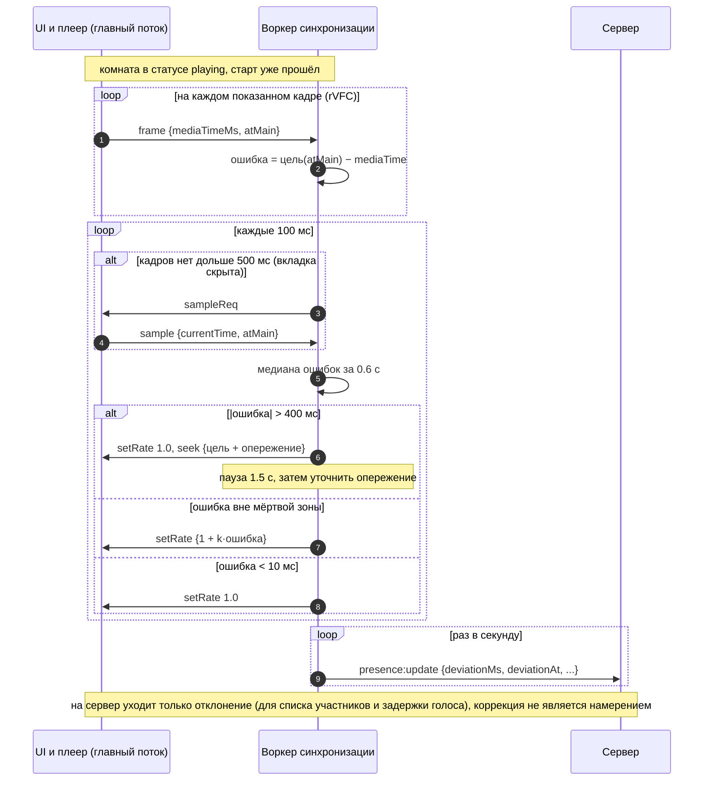

# Обнаружение и гашение расхождения

Документ описывает контур удержания: как клиент после старта замечает, что
его плеер разошёлся с комнатой, и возвращает его обратно. Читается вместе
с диаграммой ниже. Старт воспроизведения описан в `sync-start.md`,
вход посреди просмотра — в `sync-latejoin.md`.

Всё, что здесь написано, реализовано и измерено в прототипе — ветка
`spike/sync`, папка `spikes/sync/` (модуль `core/controller.ts`, замеры
`tools/measure.ts`).
Числа в разделе 8 — оттуда, а не из головы.

---

## 1. Диаграмма



---

## 2. Что измеряется

**Ошибка** — насколько позиция плеера отличается от позиции комнаты в тот же
момент времени:

```
ошибка = цель(t) − позиция(t)
цель(t) = positionMs + (серверное_время(t) − anchorServerTime) × rate
```

Плюс — отстаём, минус — спешим.

### Источник позиции

**Основной — `requestVideoFrameCallback`.** На каждом показанном кадре главный
поток отдаёт воркеру пару `mediaTime` (метка кадра) и `expectedDisplayTime`
(момент показа). Это точная пара «что показано — когда показано».

Почему не `currentTime`: это приближение, которое обновляется
с непредсказуемой частотой; в Chrome оно идёт по звуковым часам и двигается
ступеньками (в прототипе видны шаги ±8 мс). Само значение браузеры
не округляют (так прямо сказано в MDN), но и точным моментом показа кадра
оно не является.

**Запасной — опрос `currentTime`.** В скрытой вкладке Chrome и Firefox
rVFC не вызывают вообще (проверено: 0 вызовов за 15 с). Если кадров нет
дольше 500 мс, воркер каждые 100 мс просит главный поток прислать текущее
`currentTime`. Главный поток отвечает сразу: сообщения от воркера доходят
до скрытого окна без задержки (проверено: 0–1 мс, даже когда таймеры
окна задушены до раза в секунду).

### Перевод времени между потоками

`atMain` — метка из шкалы главного потока. У воркера своя шкала:
`performance.now()` отсчитывается от момента создания воркера, а не от
загрузки страницы. В разных запусках прототипа разница была от 45 до 95 мс. Без поправки вся
ошибка сдвигается на эту величину.

Поэтому воркер измеряет смещение до главного потока тем же обменом, что
и до сервера (NTP с минимальной задержкой, модуль `core/clock.ts`),
и переводит все метки:

```
atWorker = atMain − mainOffset
серверное_время = atWorker + serverOffset
```

---

## 3. Фильтр

Одна выборка шумит: кадр при 24 fps длится 41.7 мс, а показывается
на ближайшем обновлении экрана. Если реагировать на каждую выборку,
контроллер будет дёргать скорость сам по себе.

Берётся **медиана** ошибок за последние 600 мс, не меньше трёх выборок.
Медиана, а не среднее: одиночный выброс (замирание, кадр с опозданием)
её не сдвигает. В прототипе отфильтрованная ошибка в покое держалась
с разбросом около ±1 мс.

---

## 4. Решение

| Отфильтрованная ошибка | Действие |
|---|---|
| меньше 10 мс | вернуть скорость 1.0 и выйти из коррекции |
| 10–35 мс | если коррекция уже идёт — продолжать, иначе ничего |
| 35–400 мс | коррекция скоростью: `rate = 1 + 0.0002 × ошибка`, в пределах ±3 %, не меньше ±0.3 % |
| больше 400 мс | перемотка на `цель + опережение` |
| Safari: больше 150 мс | только перемотка, скорость не трогаем |

### Почему два порога, а не один

Гистерезис. С одним порогом (например, 40 мс) ошибка около 40 мс то
включает коррекцию, то выключает — скорость «дребезжит». Входим
в коррекцию выше 35 мс, выходим ниже 10 мс.

### Почему скорость пропорциональна ошибке

Фиксированные ±2 % либо слишком медленны для большой ошибки, либо
перескакивают малую. Пропорциональная поправка быстро гасит большое
расхождение и мягко доводит малое. 100 мс ошибки дают 2 %, 150 мс и
больше упираются в потолок 3 %. При `preservesPitch` (включён по умолчанию)
изменение темпа на несколько процентов почти не слышно в речи.

### Почему не меньше ±0.3 %

Звуковой рендерер Chrome считает скорость в пределах примерно ±0.1 %
от 1.0 «почти единицей» и играет ровно 1.0
(`media/filters/audio_renderer_algorithm.cc`, окно 20 мс). А позиция
в Chrome идёт по звуковым часам — значит, поправка 1.001 просто ничего
не делает. Минимальный шаг берётся с запасом: 0.3 %.

### Почему скорость меняется не чаще раза в секунду

Переход между 1.0 и не 1.0 при `preservesPitch` переключает алгоритм
растяжения звука, и это может дать щелчок — об этом прямо сказано
в комментарии того же файла Chromium. Поэтому скорость удерживается
минимум секунду, и мелкие изменения (меньше 0.002) не применяются вовсе.
Исключение — смена знака ошибки: её применяем сразу, иначе будет перелёт.

### Почему перемотка от 400 мс

Скоростью 3 % ошибка в 400 мс гасится больше 13 секунд (3 % — это 30 мс
в секунду, а по мере уменьшения ошибки скорость ещё и снижается) — дольше,
чем комфортно при живом голосовом чате. Короткий рывок лучше. Порог
совпадает с `SkipToSync` в Jellyfin SyncPlay.

### Опережение перемотки

Пока плеер перематывается и буферизуется, комната уходит вперёд. Поэтому
перемотка идёт на `цель + опережение`. Начальное значение 60 мс,
дальше контроллер учится: первое измерение после перемотки показывает
промах, и опережение сдвигается на половину промаха.

### Защита от «молотилки»

Если перемоток больше трёх за 10 секунд, порог перемотки удваивается
(до 2 с). Так ведёт себя MediaSync: слабое устройство, которое не успевает,
не должно перематываться каждые полторы секунды. Через минуту без
перемоток порог возвращается.

### Safari

В Safari каждое изменение `playbackRate` замораживает воспроизведение
на 0.1–0.3 с (WebKit bug 163433, открыт с 2016 года; то же пишет
документация MediaSync про iOS). Коррекция скоростью там делает хуже,
чем ничего. Контроллер определяет WebKit по строке браузера и работает
только перемотками с порогом 150 мс.

---

## 5. Опережение старта

Отдельная обучаемая величина, которой не было в первой версии.

Между вызовом `play()` и началом движения головки проходит время.
В прототипе на Chromium это 40–60 мс, на других браузерах и устройствах
будет иначе. Если вызывать `play()` ровно в момент якоря, каждый старт
начинается с отставания на эту величину.

Поэтому `play()` вызывается на `startLeadMs` раньше якоря, а первое
измерение после старта уточняет это значение (тоже на половину промаха).
В прототипе опережение сходится к 46–58 мс. Систематическое отставание
при старте оно убирает, но на перегруженной песочнице, где вкладки
периодически подвисают, одиночное измерение шумное, и повторный старт
иногда перелетает вперёд на несколько десятков миллисекунд. Контур это
гасит, но на обычной машине результат нужно перепроверить.

---

## 6. Когда контур молчит

Есть два разных вида паузы, и их нельзя путать.

**`hold` — пауза измерений.** Плеер перематывается или буферизуется
(события `seeking`, `waiting`) — 500 мс; вкладка вернулась из фона — 1 с
(Chrome после 10 секунд в фоне отключает видеодорожку и при возврате
включает её внутренней перемоткой). Выборки сбрасываются, но текущая
скорость и ожидающее обучение опережения сохраняются.

**`suspend` — сброс.** Пришло новое состояние комнаты (старт, пауза,
перемотка любого участника). Скорость возвращается к 1.0, обучение
отменяется: промах после новой команды ничего не говорит о прошлой
перемотке.

Первая версия прототипа путала эти два случая: событие `seeking` после
собственной перемотки контроллера сбрасывало обучение, и опережение
перемотки навсегда оставалось 60 мс. Ошибка нашлась по замерам.

Пока контур молчит, отклонение в `presence:update` всё равно честное:
позиция плеера против позиции комнаты, а не ноль и не последнее
сглаженное значение. Плеер стоит, комната идёт — отклонение растёт,
и задержка голоса (`decisions.md`, 5.1) должна это видеть. В прототипе
сейчас в это время уходит 0 — это ошибка, которую предстоит исправить.

---

## 7. Чего контур не делает

**Не отправляет намерения.** Перемотка и смена скорости — локальные
действия. На сервер уходит только `presence:update` с отклонением для
списка участников и задержки голоса. Если бы восстановление шло через `playback:intent`,
сбой одного участника дёргал бы всю комнату.

**Не слушает события `video` как команды.** `pause`, `seeked`,
`ratechange` возникают и от наших собственных команд, и от браузера
(Chrome сам ставит на паузу скрытое беззвучное видео). Если превращать
их в намерения, получится петля: пауза пришла с сервера → событие pause →
намерение pause → сервер → … Так ломались Syncplay (issue #73)
и Microsoft Live Share (issue #735). Намерения рождаются только
из наших кнопок.

---

## 8. Измерения

Прототип, headless Chromium 141, Linux, 2 ядра. Два независимых прогона
по три повтора каждого сценария, на одном и том же коде синхронизации.
Расхождение считается не по самооценке клиентов, а по абсолютному времени:
вкладки одной машины живут на одних часах, поэтому
`позиция_A(t) − позиция_B(t)` — честная ошибка.

| Сценарий | Что мерили | Прогон 1, медиана | Прогон 2, медиана | Все 6 повторов |
| --- | --- | --- | --- | --- |
| Старт, сеть без задержек | расхождение в момент старта | 4 мс | 2 мс | от −17 до +8 мс |
| | держится потом, 95-й перцентиль | 6 мс | 18 мс | 4–35 мс |
| Повторный старт | расхождение в момент старта | 15 мс | 61 мс | 0–83 мс |
| | держится потом, 95-й перцентиль | 8 мс | 30 мс | 8–52 мс |
| У одного участника RTT 120 мс | держится, 95-й перцентиль | 8 мс | 2 мс | 0–19 мс |
| Асимметрия: к серверу 100 мс, обратно 0 | реальное расхождение, медиана | **42 мс** | **57 мс** | 36–64 мс; клиент оценивает себя в 17–24 мс |
| Сбой: участник прыгнул на 300 мс | время до расхождения меньше 30 мс | 9.7 с | 8.7 с | 8.3–10.7 с, без перемоток |
| Сбой: участник прыгнул на 900 мс | время до расхождения меньше 30 мс | 3.7 с | 5.4 с | 2.3–6.2 с, одна перемотка |
| | выученное опережение перемотки | 84 мс | 88 мс | 82–90 мс, начальное 60 |
| Вход посреди просмотра | от клика «Присоединиться» до начала игры | 0.98 с | 0.96 с | 0.95–1.0 с |
| | держится потом, 95-й перцентиль | 22 мс | 22 мс | 19–42 мс |
| | комната останавливалась | нет | нет | ни разу |
| Разница точек отсчёта воркера и окна | | 61 мс | 49 мс | 45–76 мс; в опытах с фоном до 95 |

Главное, что видно из двух прогонов: **разброс между ними большой**.
Логика синхронизации между прогонами не менялась (правились только раздача
файлов сервером и проверка мёртвого соединения). Значит, это шум перегруженной
машины: две вкладки декодируют видео на двух ядрах и иногда одновременно
подвисают. Поэтому числа здесь — порядок величины, а не характеристика
алгоритма. Честные числа дадут прогоны на ноутбуках.

В пределах этого шума во всех 36 повторах пара держалась в бюджете 100 мс
после того, как контур успевал сработать. Хуже всего вёл себя повторный
старт: в момент старта до 83 мс, дальше контур гасил расхождение.

Абсолютная ошибка относительно комнаты (по самооценке клиента, которой
на одной машине можно верить) в спокойном режиме держится в пределах мёртвой
зоны, около 20 мс. Через секунду после первого старта она бывает до ~55 мс.
Опережение старта сходится к 46–58 мс, но на перегруженной машине иногда
перелетает; на обычной это нужно перепроверить.

Что стоит держать в голове, читая эти числа.

- Песочница перегружена: две вкладки декодируют VP9 на двух ядрах,
  и иногда обе одновременно замирают. Отсюда разброс между прогонами.
- В headless нет звуковой карты. На ноутбуке с колонками и особенно
  с Bluetooth-наушниками задержки будут другими.
- Асимметричная сеть — единственный случай, где контур бессилен: клиент
  уверен, что всё хорошо, а на деле сдвинут на половину разницы задержек.
  Это свойство NTP-оценки, а не ошибка реализации.

Скрытая вкладка (настоящий Chrome под Xvfb, участник скрыт на 20 с):

| Звук у скрытого | Что происходило |
|---|---|
| со звуком | переход на опрос `currentTime`, всплеск до ~100 мс, погашен за ~10 с |
| `volume = 0` | расхождение 1–2 мс всё время |
| `muted` после игры со звуком | ~22 мс, через 10 с всплеск до 57 мс (отключение видеодорожки), погашен |
| `muted` с самого начала | **браузер ставит видео на паузу**, теряется всё время скрытия |

Последняя строка — причина правила: «выключить звук фильма» делается
громкостью (`volume` или `GainNode`), а не `muted`.

---

## 9. Параметры

В прототипе все параметры собраны в `DEFAULT_CONFIG` в `core/controller.ts`.

| Параметр | Значение | Откуда |
|---|---|---|
| `enterMs` / `exitMs` | 35 / 10 мс | гистерезис; разброс отфильтрованной ошибки в прототипе ±1 мс |
| `gainPerMs` | 0.0002 | 100 мс → 2 % |
| `maxRateDelta` | 0.03 | 3 %, практически не слышно при `preservesPitch` |
| `minRateDelta` | 0.003 | мёртвая полоса Chrome ±0.1 % с запасом |
| `rateHoldMs` | 1000 мс | щелчки при переключении алгоритма растяжения |
| `seekMs` | 400 мс | Jellyfin SkipToSync |
| `seekCooldownMs` | 1500 мс | Jellyfin |
| `filterWindowMs` | 600 мс | ~14 кадров при 24 fps |
| `initialSeekLeadMs` | 60 мс | уточняется по факту |
| `initialStartLeadMs` | 40 мс | уточняется по факту, в Chromium сходится к 54–58 |
| `seekOnlyThresholdMs` | 150 мс | Safari |

---

## 10. Что изменилось по сравнению с `sync-start.md`

В первой версии было: мёртвая зона 40 мс, скорость ±2 %, перемотка
от 250 мс. Сейчас: гистерезис 35/10 мс, пропорциональная скорость до ±3 %
с минимальным шагом 0.3 %, перемотка от 400 мс, фильтр-медиана, два
обучаемых опережения и отдельный режим для Safari. Каждое изменение
объяснено выше и опирается либо на исходники браузера, либо на замер.

---

## 11. Открытые вопросы

**Щелчки при смене скорости.** Проверяется только на слух, на настоящих
колонках. Если слышно — варианты: `preservesPitch = false` на время
коррекции (сдвиг высоты около трети полутона при 2 %) или реже менять
скорость.

**Safari и iOS.** Режим «только перемотка» написан по документации,
в Safari не проверялся — нужен Mac.

**Bluetooth.** Задержку звука наушников браузер может не знать, и тогда
участник в AirPods слышит фильм на 100–250 мс позже остальных. Измерить
её для `<video>` нельзя; можно дать ручную поправку в настройках.

**Параметры на слабых устройствах.** Числа подобраны на одной машине.
Прежде чем фиксировать, стоит прогнать сценарии на ноутбуках всей команды.

---

## 12. Связанные документы

- `architecture.md` — из чего состоит система
- `protocol.md` — описание сообщений
- `sync-start.md` — одновременный старт
- `sync-latejoin.md` — подключение к идущему просмотру
- ветка `spike/sync`, `spikes/sync/README.md` — прототип и как повторить замеры
