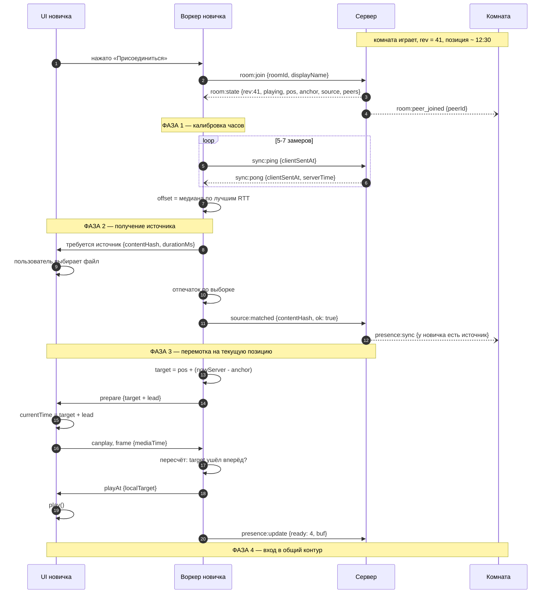

# Подключение к идущему просмотру

Документ описывает сценарий, в котором участник входит в комнату, где просмотр
уже идёт. Читается вместе с диаграммой последовательности ниже.

Ключевое свойство сценария: **входящий не смотрит с начала и не догоняет
постепенно — он перематывается сразу на текущую позицию комнаты**. Поэтому
комната не останавливается ради него: ожидание не дало бы ему ничего.
Подробное обоснование в разделе 5.

Предполагается, что читатель знаком с `architecture.md` и `protocol.md`.

---

## 1. Диаграмма



---

## 2. Предусловия

Комната существует и находится в состоянии `playing`. У остальных участников
воспроизведение идёт нормально.

У новичка **нет ничего**: ни измеренного смещения часов, ни выбранного файла,
ни установленных WebRTC-соединений. В этом отличие от сценария первого старта,
где к моменту нажатия «плей» все три вещи уже были.

---

## 3. Пошаговый разбор

### Вход

**Шаг 1. Пользователь нажимает «Присоединиться».**

Кнопка нужна не только как элемент интерфейса. Она служит **разрешающим жестом**
сразу для двух браузерных политик: программный вызов `play()` без
предшествующего жеста пользователя блокируется, а `AudioContext` создаётся
в приостановленном состоянии и требует явного `resume()`. Автоматический вход
в комнату по открытию ссылки сломал бы и то, и другое.

**Шаг 2. Воркер отправляет запрос на вход.**

**Шаг 3. Сервер отдаёт снапшот комнаты.**

Приходит `room:state` с полным состоянием: номер ревизии, статус, позиция,
якорь, описание источника, список участников.

Важно: **в этот момент снапшот бесполезен**. Поле `anchorServerTime` выражено
в серверных часах, а новичок ещё не знает своего смещения относительно них.
Он не может вычислить, какой позиции соответствует «сейчас». Поэтому следующая
фаза — не воспроизведение, а калибровка.

**Шаг 4. Остальные узнают о новом участнике.**

---

### Фаза 1. Калибровка часов

**Шаги 5–7. Серия обменов ping/pong.**

Выполняется 5–7 замеров. По каждому вычисляется `rtt = now − clientSentAt`
и `offset = serverTime + rtt/2 − now`. Берётся медиана по выборкам
с наименьшим RTT, выбросы отбрасываются.

**Шаг 8. Смещение зафиксировано.**

Только теперь снапшот из шага 3 обретает смысл. Это жёсткая последовательная
зависимость: без неё все дальнейшие вычисления позиции дают случайный результат.

Пока идёт калибровка, комната продолжает играть, и позиция из снапшота
устаревает. Это не проблема: в шаге 14 мы пересчитываем её от якоря,
а не используем как есть.

---

### Фаза 2. Получение источника

**Шаг 9. Воркер сообщает интерфейсу, какой файл нужен.**

Передаются отпечаток и длительность из снапшота. Интерфейс показывает экран
выбора файла с подсказкой — что именно смотрят и сколько оно идёт.

**Шаг 10. Пользователь выбирает файл.**

Самая длинная по времени часть сценария и единственная, полностью вне нашего
контроля: человек ищет файл на диске. Комната тем временем играет.

**Шаг 11. Вычисление отпечатка.**

Считается не полный хеш файла, а хеш от размера и 33 фрагментов по 1 МиБ,
взятых равномерно по файлу. Длительность сравнивается отдельно, с допуском
около секунды: разные браузеры сообщают её по-разному. Причина: браузерный API
вычисления дайджеста не поддерживает потоковый ввод — весь вход требуется
прочитать в память целиком, что для многогигабайтного файла неприемлемо.

**Шаг 12. Отправка результата сверки.**

Если отпечаток не совпал, участник видит предупреждение. Рекомендация —
не запрещать просмотр: разные раздачи одного фильма не совпадают никогда.
Строгий вариант — режим наблюдателя без видео. Выбор за командой
(`decisions.md`, раздел 6.2).

**Шаг 13. Остальные видят, что у новичка появился источник.**

---

### Фаза 3. Перемотка на текущую позицию

**Шаг 14. Вычисление целевой позиции.**

```
target = positionMs + (nowServer − anchorServerTime)
```

где `nowServer` — текущий момент по серверным часам, вычисленный из локальных
часов и измеренного смещения.

**Шаг 15. Перемотка с опережением.**

Единственное неочевидное место сценария.

Наивная реализация перематывает ровно на `target`. Но перемотка запускает
буферизацию, которая занимает время, и пока буфер наполняется, комната
продолжает играть. К моменту готовности новичок оказывается позади ровно
на длительность буферизации — то есть сразу после успешной перемотки
он уже отстал.

Поэтому перематываем на `target + lead`, где `lead` — оценка времени
буферизации. Для локального файла это сотни миллисекунд, для P2P-потока
заметно больше. Стратегия: первая попытка с консервативной оценкой,
затем корректировка по факту.

**Шаг 16. Плеер готов, приходит первый кадр.**

**Шаг 17. Пересчёт.**

Воркер сравнивает фактическую позицию с новым значением `target`. Если
буферизация заняла больше, чем заложено в `lead`, — нужна ещё одна короткая
перемотка. Если меньше — небольшое опережение погасит контур скоростью.

**Шаги 18–19. Запуск воспроизведения** в вычисленный локальный момент.

**Шаг 20. Отчёт о готовности.** Новичок включается в общий обмен присутствием.

---

### Фаза 4. Вход в контур

Дальше работает обычный контур удержания, описанный в `sync-drift.md`.

В прототипе (демо-ролик, без задержек в сети) от нажатия «Присоединиться»
до начала воспроизведения проходит около секунды: калибровка часов плюс
подготовка плеера. Расхождение с комнатой сразу после старта — единицы
и десятки миллисекунд, перемоток не требуется. Комната при этом не
останавливается ни разу.

---

## 4. Голосовой канал при расхождении

Раздел описывает, что происходит со звуком, когда позиции участников
разошлись. Это касается не только входящих, поэтому логика общая.

### Почему это вообще проблема

Голос идёт практически без задержки, а видео синхронизировано с некоторой
точностью. Если участник отстаёт, он слышит реакции остальных на то, чего
ещё не увидел.

Но важно правильно оценить масштаб. В установившемся режиме контур держит
расхождение в пределах нескольких десятков миллисекунд (замеры —
в `sync-drift.md`). Входящий участник перематывается на текущую позицию,
а не смотрит с начала, поэтому после подключения его отставание — десятки
миллисекунд. **В штатной работе обработка голоса не требуется вообще.**

Расхождение, при котором проблема реальна, возникает только по техническим
причинам, потому что действия пользователя расхождения не создают: перемотка
и пауза в нашей модели применяются ко всей комнате сразу. Остаются три случая:

- участник со слабым каналом ушёл в свободный ход после дедлайна барьера;
- долгая буферизация после общей перемотки;
- участник вернулся из фоновой вкладки, где контур был слеп.

Во всех трёх случаях человек не совершал действия, приведшего к расхождению,
и не должен разбираться, почему он отстал. Из этого следует поведение,
описанное в разделе 5.

### Принятое решение: три уровня

**До 250 мс — ничего не делаем.** Рабочий диапазон, обработка не нужна.
Число 250 мс — наше допущение о том, какой рассинхрон голоса и картинки
ещё не мешает разговору; его нужно проверить на людях (открытый вопрос ниже).

**От 250 мс до нескольких секунд — задерживаем входящий голос** на величину
расхождения. Реализуется узлом `DelayNode` на каждого удалённого участника:
если вы отстаёте на секунду, голоса остальных приходят к вам на секунду позже
и совпадают с тем, что вы видите. Разговор становится вялым, но не ломается,
и происходит это только у отстающего — остальные ничего не замечают.

**Больше нескольких секунд — это не дрейф, а разные позиции просмотра.**
Здесь честный ответ не аудиообработка, а интерфейс: показать расхождение
и дать возможность его устранить. Скрывать расхождение техническими средствами
бессмысленно — если человек сам отмотал назад, он знает, что отстал.
Подробная спецификация в разделе 5.

### Что отклонили

**Приглушение голоса до схождения.** Решение, которое напрашивается первым,
но оно ломает продукт: люди пришли смотреть вместе, а мы отключаем им общение
в момент, когда оно нужнее всего. Отстающий не понимает, почему стало тихо,
и не может спросить.

**Встроенный механизм `playoutDelayHint` у WebRTC.** Выглядит как готовое
решение, но джиттер-буфер наращивает задержку постепенно, а не выставляет
мгновенно: в сторонних замерах на двухсекундный хинт уходило около тридцати
секунд до схождения. Нужен свой `DelayNode` с мгновенным выставлением
через `setValueAtTime`.

### Социальный слой

Отдельно от аудиообработки: в списке участников отображается индикатор
отклонения каждого. Это решает ту же проблему дешевле и честнее — когда видно,
кто ушёл вперёд, ушедший сам понимает, когда стоит помолчать. Приём взят
из практики обычных совместных просмотров, где видимость прогресса работает
лучше любых технических мер.

Требует одного дополнительного поля в `presence:sync`.

### Технические детали реализации

Узел `DelayNode` по умолчанию имеет `maxDelayTime` в одну секунду, и это
жёсткий потолок узла: задержку больше указанного максимума выставить нельзя.
Создавать нужно с явным параметром — разумное значение около пяти секунд.
Верхняя граница, допустимая спецификацией, — 180 секунд.

Изменение задержки на ходу выполняется через `setValueAtTime`, а не простым
присваиванием: это даёт предсказуемый момент применения.

---

## 5. Индикатор расхождения и восстановление

Раздел описывает, что происходит, когда позиция участника разошлась с позицией
комнаты.

### Расхождение всегда техническое

В нашей модели управление воспроизведением общее: перемотка, пауза и снятие
с паузы, выполненные любым участником, применяются ко всей комнате. Поэтому
пользователь **не может отстать намеренно** — нет действия, которым он вывел бы
себя из синхронизации.

Отсюда главное следствие: любое расхождение — это сбой, а не выбор. Человек
к нему непричастен и не должен его устранять. **Восстановление выполняется
автоматически.**

### Автоматическое восстановление

При превышении верхнего порога контура воркер выполняет восстановление
без участия пользователя:

1. Вычисляется `target` по формуле из фазы 3 от актуального якоря.
2. Выполняется перемотка на `target + lead`.
3. Ожидается готовность плеера, при необходимости выполняется уточняющая
   перемотка.
4. Клиент возвращается в общий контур удержания.
5. Задержка голосового канала возвращается к нулю.

**На сервер не отправляется ничего, кроме обычного `presence:update`.**
Это критично: восстановление выглядит как перемотка, но намерением
(`playback:intent`) не является и состояние комнаты менять не должно.
Если отправить намерение, у всех остальных дёрнется плеер — то есть сбой
одного участника размножится на всю комнату.

### Что видит участник

Восстановление занимает время буферизации, и в этот момент показывается
статус, а не предложение действия:

```
Догоняем комнату…
```

Плашка появляется, когда расхождение держится выше порога дольше заданного
времени — иначе она мигала бы при кратких подвисаниях, которые контур гасит
сам. Исчезает после схождения.

Порог отображения заведомо выше порогов контура: скоростью контур гасит
расхождение до 400 мс, дальше перематывает, а плашка появляется от нескольких
секунд. Между 250 мс и порогом плашки расхождение для голоса компенсируется
задержкой молча.

### Ручное восстановление как запасной путь

Кнопка нужна только для случая, когда автоматическое восстановление
не справляется: участник со слабым каналом отстаёт снова сразу после
каждой перемотки.

После нескольких неудачных попыток подряд автоматическое восстановление
прекращается, чтобы не устраивать человеку бесконечную череду рывков,
и плашка меняется на:

```
Не получается синхронизироваться     [Попробовать снова]
```

Нажатие запускает ту же последовательность вручную. Это единственная ситуация,
в которой пользователю предлагается что-то нажать.

### Что показывается про остальных

В списке участников рядом с именем отображается отклонение того, кто отстал:

```
Аня       −4 с
Борис
Вера
```

У участников, чьё отклонение ниже порога, не показывается ничего — иначе
список превращается в мельтешащие цифры. Питается полем отклонения
в `presence:sync`.

Отображение нужно, чтобы остальные понимали, почему человек не реагирует
на происходящее на экране, и не считали это его молчанием.

### Кнопка «Подождать входящего»

Единственная кнопка в комнате, влияющая на всех. Не путать с восстановлением.

| | Восстановление | Подождать входящего |
|---|---|---|
| Инициатор | автоматически, клиент отставшего | любой участник |
| На кого влияет | только на себя | на всю комнату |
| Что делает | перемотка к позиции комнаты | ставит просмотр на паузу |
| Отправляется на сервер | нет | `playback:intent {pause}` |
| Когда показывается | статус, действия не требует | когда кто-то входит и ещё не готов |

---

## 6. Почему комната не ждёт новичка

Главное архитектурное решение сценария. Аргументов два, и первый сильнее.

**Ожидание бесполезно.** Входящий перематывается на текущую позицию комнаты,
а не начинает просмотр с начала. Если комната остановится и подождёт его,
он окажется ровно там же, где оказался бы без ожидания. Единственное, что
даёт пауза, — возможность досмотреть без пропуска, но пропускать нечего:
он подключается к тому месту, где все находятся.

**Ожидание вредно.** Самая долгая часть сценария — поиск файла на диске,
и её длительность мы не контролируем. Если комната останавливается ради
каждого входящего, любой вход прерывает просмотр остальным на неопределённое
время. В реализациях подобного класса чрезмерная компенсация одного отстающего
приводила к постоянным откатам назад для всех остальных — известный провал,
который мы воспроизводить не хотим.

Барьер готовности в нашей системе поэтому **холодный**: он срабатывает при
первом старте и после явной перемотки, но не при входе нового участника
и не при каждом подвисании.

**Компромисс.** У участников есть кнопка «подождать входящего», которая ставит
просмотр на паузу явным действием человека. Решение принимает пользователь,
а не алгоритм.

---

## 7. Ветвления

Сценарий выше описывает успешный путь. Дополнительно обрабатываются:

**Отпечаток не совпал.** Предупреждение с подсказкой по длительности:
«похоже на тот же фильм из другой раздачи» или «это другой файл».
По рекомендации смотреть не мешаем; строгий вариант — режим наблюдателя
(чат и голос есть, видео нет). Решает команда, `decisions.md`, раздел 6.2.

**Формат файла не поддерживается.** То же самое, с другим сообщением.

**Комната на паузе в момент входа.** Сценарий упрощается: фаза 3 сводится
к обычной перемотке без опережения, потому что позиция не движется.

**Источник в комнате — P2P-поток.** Добавляется установка соединения
с раздающим и запрос диапазона байтов от целевой позиции. Раздающий получает
дополнительную нагрузку на исходящий канал, и при достижении предела
подключение может быть отклонено.

**Комната заполнена.** Сервер отвечает ошибкой `room_full` ещё на шаге 2.

**Вкладка ушла в фон до того, как видео загрузилось.** Chrome не начинает
загружать видео в скрытой вкладке, пока её не откроют (проверено
в прототипе: `readyState` 0 и пустой буфер всё время, пока вкладка скрыта).
Новичок в этом состоянии не станет «готов». На вход это не влияет —
комната его не ждёт, — но если в этот момент кто-то нажмёт «перемотать»,
барьер будет ждать его до дедлайна. В списке участников такого человека
стоит показывать как «не на вкладке».

---

## 8. Открытые вопросы

**Значение `lead`.** Константа или адаптивная оценка по истории буферизации.
Требует замеров на реальных файлах.

**Нижний порог включения задержки голоса.** Сейчас это 250 мс — допущение.
Проверяется на людях, а не расчётом.

**Верхняя граница режима задержки.** С какого расхождения переходить
от компенсации голоса к автоматическому восстановлению.

**Задержка появления плашки.** Сколько времени расхождение должно держаться
выше порога, прежде чем показывать статус. Слишком мало — мигание при
подвисании, слишком много — человек успевает не понять, что происходит.

**Число попыток автоматического восстановления** перед переходом к ручному
режиму.

**Подавление дребезга при перемотке.** Перемотка любого участника применяется
ко всей комнате и поднимает барьер готовности. Если пользователь тащит ползунок,
намерения полетят потоком, и комната будет непрерывно уходить в ожидание.
Нужно отправлять намерение по завершению перетаскивания, а не в процессе,
плюс ограничение частоты на сервере. Требует отдельной проработки
в `protocol.md`.

**Поведение при систематическом отставании.** Если у участника слабое
устройство и он отстаёт постоянно, нужен ли явный режим «смотрю отдельно»
с выходом из синхронизации.

---

## 9. Связанные документы

- `architecture.md` — из чего состоит система
- `protocol.md` — описание сообщений и полей
- `sync-start.md` — одновременный старт воспроизведения
- `sync-drift.md` — обнаружение и гашение расхождения
