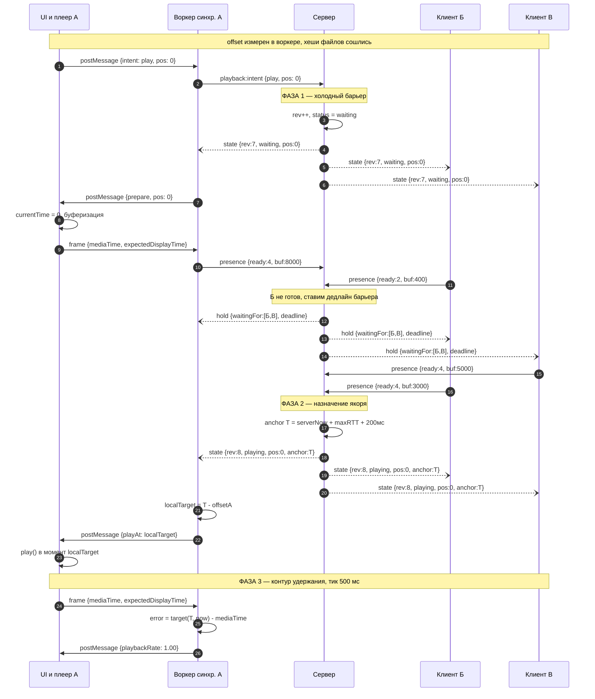

# Одновременный старт воспроизведения
---


---

Документ описывает сценарий синхронного запуска видео у всех участников комнаты.
Читается вместе с диаграммой последовательности в этом же файле.

Задача сценария: сделать так, чтобы в один и тот же физический момент времени
у всех участников головка воспроизведения находилась в одной и той же позиции
видеоряда, притом что у каждого свой плеер, свой буфер и свои часы.

---

## 1. Кто участвует в обмене

На диаграмме пять дорожек. Три из них — это три разных устройства, но первое
устройство показано двумя дорожками, чтобы было видно разделение внутри клиента.

**UI и плеер А** — главный поток браузера у инициатора. Здесь живут React-компоненты,
элемент `<video>` и обработчики пользовательского ввода. Этот поток **не владеет**
сетевым соединением и **не принимает решений** о синхронизации.

**Воркер синхронизации А** — Web Worker у того же инициатора. Здесь находятся:
WebSocket-соединение с сервером, оценка смещения часов, контур коррекции дрейфа.
Общение с главным потоком идёт через `postMessage`.

**Сервер** — Node-приложение. Хранит авторитетное состояние комнаты и ретранслирует
сообщения. Не хранит и не передаёт видеоданные.

**Клиент Б** и **Клиент В** — остальные участники. Внутри у них ровно та же пара
«главный поток + воркер», но на диаграмме они свёрнуты в одну дорожку, чтобы
не загромождать картинку.

### Почему воркер вынесен отдельно

Это не украшение схемы, а вынужденное решение. В неактивной вкладке браузер
принудительно приводит таймеры главного потока к одному срабатыванию в секунду,
а `requestAnimationFrame` не вызывается вовсе. Контур синхронизации с периодом
500 мс в главном потоке в фоновой вкладке просто перестаёт работать.
Таймеры внутри Web Worker этому дросселированию не подвержены, поэтому и сокет,
и часы, и контур живут там.

---

## 2. Соглашения протокола

**Транспорт.** WebSocket, формат JSON. Все интервалы времени — в миллисекундах.

**Конверт сообщения.** У каждого сообщения есть `type` и `payload`. Идентификатор
комнаты в сообщениях не передаётся — он привязан к соединению после `room:join`.

**Единая шкала времени.** Общей шкалой является серверное время. Клиент никогда
не доверяет собственным системным часам, потому что они могут скачком измениться
при синхронизации с NTP. Для внутренних измерений клиент использует
`performance.now()` — монотонный счётчик, не подверженный таким скачкам.

**Источник правды.** Состояние воспроизведения принадлежит серверу. Клиент не
командует «играй» — он присылает намерение, сервер принимает решение и рассылает
новое состояние всем. Это снимает гонки, когда двое одновременно нажали паузу.

**Что никогда не передаётся по WebSocket.** Байты видеофайла и содержимое буфера.
Файл остаётся на устройстве участника.

---

## 3. Словарь полей

Поля перечислены в том порядке, в котором встречаются на диаграмме.

### `playback:intent` — намерение клиента

| Поле | Тип | Смысл |
|---|---|---|
| `action` | `play` \| `pause` \| `seek` | что хочет сделать пользователь |
| `positionMs` | число | позиция в видеоряде, к которой относится намерение |

Клиент отправляет намерение и **не меняет состояние своего плеера**. Он ждёт
ответа сервера. Если разрешить клиенту менять состояние оптимистично, при
отклонении намерения придётся откатываться, и пользователь увидит рывок.

### `playback:state` — авторитетное состояние комнаты

| Поле | Тип | Смысл |
|---|---|---|
| `rev` | целое, монотонно растёт | номер ревизии состояния |
| `status` | `playing` \| `paused` \| `waiting` | что происходит в комнате |
| `positionMs` | число | позиция в видеоряде |
| `anchorServerTime` | число | момент по серверным часам, к которому относится `positionMs` |
| `rate` | число | скорость воспроизведения, назначенная комнате (обычно 1.0) |
| `initiatedBy` | peerId | кто инициировал изменение, нужно только для UI |

**Про `rev`.** Клиент игнорирует сообщение, у которого `rev` меньше уже применённого.
Без этого счётчика возможна ситуация: двое почти одновременно нажали паузу,
сообщения пришли третьему участнику в обратном порядке, и он применил устаревшее.

**Про `status: waiting`.** Третье состояние, которого нет в наивных реализациях.
Означает: сервер намерен играть, но удерживает старт, пока не готовы все.

**Про `anchorServerTime`** — самое важное поле протокола. Пара
`(positionMs, anchorServerTime)` читается так: «в момент `anchorServerTime`
по серверным часам головка воспроизведения должна находиться в позиции `positionMs`».
Команды вида «играй прямо сейчас» в протоколе нет вообще, потому что понятия
«сейчас» в распределённой системе не существует: у каждого участника свои часы
и своя задержка до сервера.

### `presence:update` — отчёт клиента о готовности

| Поле | Тип | Смысл |
|---|---|---|
| `readyState` | 0–4 | значение `readyState` элемента `<video>` |
| `bufferedAheadMs` | число | сколько миллисекунд забуферено впереди текущей позиции |
| `isSeeking` | булево | идёт ли сейчас перемотка |
| `hasSource` | булево | выбран ли источник видео |

**Почему два поля вместо одного.** `readyState` сам по себе недостаточен:
браузер выставляет `HAVE_ENOUGH_DATA` (значение 4) при совсем небольшом буфере,
и через секунду плеер снова встаёт. Поэтому барьер проверяет ещё и
`bufferedAheadMs` с порогом.

Отправляется раз в секунду и дополнительно при каждой смене состояния.

### `playback:hold` — сообщение об удержании старта

| Поле | Тип | Смысл |
|---|---|---|
| `waitingFor` | массив peerId | кого именно ждём |
| `reason` | `buffering` \| `seeking` \| `no-source` | почему ждём |
| `deadline` | число | момент по серверным часам, после которого барьер снимается принудительно |

Поле `waitingFor` позволяет показать в интерфейсе «ждём Петю» вместо безликого
спиннера. Поле `deadline` разбирается ниже в шаге 12.

### Данные кадра — внутреннее сообщение главного потока воркеру

| Поле | Тип | Смысл |
|---|---|---|
| `mediaTime` | число, секунды | временная метка показанного кадра |
| `expectedDisplayTime` | `DOMHighResTimeStamp` | момент, когда браузер ожидает показать кадр |

Оба значения берутся из метаданных `requestVideoFrameCallback`.
Обоснование выбора именно этого источника — в разделе 6.

---

## 4. Пошаговый разбор

### Предусловия

До начала сценария должно быть выполнено три вещи.

1. У всех участников выбран источник видео, и совпадение подтверждено.
2. Воркер каждого клиента провёл серию обменов `sync:ping` / `sync:pong`
   и знает своё смещение относительно серверных часов.
3. Комната находится в состоянии `paused` на позиции 0.

Про оценку смещения: клиент отправляет `sync:ping` со своим значением
`performance.now()`, сервер отвечает `sync:pong`, возвращая это значение вместе
со своей меткой `serverTime`. Клиент вычисляет `rtt = now − clientSentAt`
и `offset = serverTime + rtt/2 − now`. Делается серия из 5–7 замеров, берётся
медиана по выборкам с наименьшим RTT, выбросы отбрасываются. Повторяется раз
в 20–30 секунд и после каждого возврата вкладки из фона.

Формула предполагает симметричный путь туда-обратно. На асимметричных маршрутах
она даёт систематическую ошибку — это известное ограничение, для наших допусков
приемлемое.

---

### Фаза 1. Холодный барьер

Цель фазы: убедиться, что все участники физически способны начать воспроизведение,
прежде чем назначать общий момент старта.

**Шаг 1. Пользователь нажимает «плей».**
Главный поток не трогает плеер и не обращается к сети. Он передаёт намерение
в воркер через `postMessage`. Разделение обязанностей выдерживается с первого шага.

**Шаг 2. Воркер отправляет намерение серверу.**
Уходит `playback:intent {action: "play", positionMs: 0}`.

**Шаг 3. Сервер меняет состояние.**
Инкрементируется `rev`, выставляется `status: waiting`. Воспроизведение ещё
не начинается.

**Шаги 4–6. Рассылка состояния ожидания.**
Всем участникам уходит `playback:state` с `rev: 7`, `status: waiting`, `positionMs: 0`.
Поля `anchorServerTime` в этом сообщении нет — момент старта ещё не назначен.
Клиенты показывают индикатор подготовки.

**Шаг 7. Воркер просит главный поток подготовить плеер.**
Уходит `postMessage {prepare, pos: 0}`.

**Шаг 8. Главный поток выставляет позицию.**
Присваивание `video.currentTime = 0` запускает перемотку, а перемотка запускает
буферизацию. Именно поэтому нельзя стартовать сразу: у Б и В в этот момент
буфер пуст.

**Шаг 9. Первый отчёт о готовности от инициатора.**
Главный поток передаёт воркеру данные кадра, воркер отправляет серверу
`presence:update` с `readyState: 4` и `bufferedAheadMs: 8000`. А готов.

**Шаг 10. Отчёт от Б.**
`readyState: 2`, `bufferedAheadMs: 400`. Б не готов: данных хватает только
на текущую позицию, продолжать воспроизведение нечем.

**Шаг 11. Сервер удерживает барьер и назначает дедлайн.**
Поскольку готовы не все, комната остаётся в `waiting`. Одновременно сервер
фиксирует момент, после которого ждать перестанет.

**Шаги 12–14. Рассылка причины ожидания.**
Уходит `playback:hold {waitingFor: [Б, В], reason: "buffering", deadline}`.

Про дедлайн отдельно. Барьер не бесконечный. Если бы он был бесконечным,
один участник с плохим каналом парализовал бы всю комнату — и это не
теоретическое опасение, а известный провал реальных реализаций. По истечении
дедлайна сервер стартует без отставшего, а тот догоняет самостоятельно
в режиме свободного хода.

**Шаги 15–16. Оставшиеся догружаются.**
В присылает `readyState: 4`, `bufferedAheadMs: 5000`. Следом Б присылает
`readyState: 4`, `bufferedAheadMs: 3000`. Оба значения выше порога, барьер
можно снимать.

---

### Фаза 2. Назначение якоря

Цель фазы: выбрать один момент времени, к которому все привяжут свой старт.

**Шаг 17. Сервер вычисляет момент старта.**

```
anchorServerTime = serverNow + maxRTT + 200мс
```

Здесь `maxRTT` — наибольшее время кругового обхода среди участников комнаты,
известное серверу из обменов `sync:ping`.

Смысл запаса: команда должна успеть дойти до самого медленного участника
и оставить ему время на подготовку. Без запаса клиент с большой задержкой
получит момент, уже прошедший по его часам, и будет вынужден догонять рывком —
то есть ровно тем, чего мы пытаемся избежать.

Константа 200 мс — это время на обработку сообщения и планирование запуска.
Ранняя версия схемы использовала фиксированные 300 мс на всё; привязка к `maxRTT`
появилась после разбора случая с медленным участником.

**Шаги 18–20. Рассылка авторитетного состояния.**
Всем уходит `playback:state {rev: 8, status: "playing", positionMs: 0, anchorServerTime: T}`.
Обратите внимание: `rev` вырос с 7 до 8. Клиент, который по какой-то причине
получит эти сообщения в обратном порядке, применит только восьмую ревизию.

**Шаг 21. Воркер переводит момент в локальную шкалу.**

```
localTarget = T − offset
```

где `offset` — смещение, измеренное этим конкретным клиентом. У А, Б и В
значения `offset` разные, поэтому и `localTarget` у каждого свой. В этом
и состоит синхронизация: разные локальные моменты соответствуют одному
физическому.

**Шаг 22. Воркер передаёт локальный момент главному потоку.**

**Шаг 23. Главный поток запускает воспроизведение.**
Вызов `play()` происходит в момент `localTarget` по шкале `performance.now()`.

Практический нюанс, которого нет на диаграмме: браузер блокирует программный
вызов `play()` без предшествующего жеста пользователя, и правила отличаются
между браузерами. У инициатора жест был — он нажал кнопку. У Б и В жеста
может не быть. Поэтому вход в комнату должен сопровождаться явным действием
(«Присоединиться»), которое одновременно служит разрешающим жестом.
Обработка отказа — отдельная ветка пользовательского флоу.

---

### Фаза 3. Контур удержания

Цель фазы: не дать расхождению накопиться после успешного старта.

С этого момента работает петля с периодом около 500 мс.

**Шаг 24. Главный поток отдаёт данные кадра.**
Источник — колбэк `requestVideoFrameCallback`, из его метаданных берутся
`mediaTime` и `expectedDisplayTime`.

**Шаг 25. Воркер вычисляет ошибку.**

```
target = positionMs + (nowServer − anchorServerTime)
error  = target − mediaTime
```

Положительная ошибка означает отставание, отрицательная — опережение.

**Шаг 26. Воркер возвращает решение.**

| Модуль ошибки | Действие |
|---|---|
| менее 40 мс | мёртвая зона, ничего не делаем |
| от 40 до 250 мс | плавная коррекция через `playbackRate` в пределах ±2% |
| более 250 мс | жёсткая перемотка |

**Про мёртвую зону.** Без неё регулятор дёргает скорость непрерывно, реагируя
на шум измерения. Порог в 40 мс лежит ниже порога восприятия и выше типичного
разброса показаний.

**Про диапазон ±2%.** Изменение скорости на два процента незаметно на слух при
включённой коррекции высоты тона (`preservesPitch` включён по умолчанию).
Более агрессивные значения слышны как «плывущий» звук.

**Про порог 250 мс.** Гасить такую ошибку скоростью пришлось бы больше десяти
секунд, что дольше, чем терпимо. Выше этого порога выгоднее один короткий рывок.

**Откуда взялись именно эти числа.** Они выведены из требования, а не подобраны
на глаз. В комнате одновременно работают два канала: видео, синхронизированное
с некоторой точностью, и голосовой чат, идущий практически без задержки.
Голос выдаёт будущее: если у соседа видео опережает ваше на секунду, вы слышите
его реакцию раньше, чем видите её причину. Поэтому целевая точность — 100 мс,
а 250 мс — порог, после которого расхождение становится заметным.

**Что происходит с отставшим.** Если участник стартовал позже из-за дедлайна
барьера, его ошибка сразу превышает верхний порог. Он делает перемотку
и входит в общий контур. Комната при этом не останавливается.

---

## 5. Результат

В момент `T` по серверным часам все участники, прошедшие барьер, находятся
в позиции 0 и воспроизводят. Дальше расхождение удерживается контуром в пределах
целевого бюджета.

---

## 6. Обоснование ключевых решений

### Почему источник позиции — `mediaTime`, а не `currentTime`

Свойство `currentTime` элемента `<video>` — это приближение текущей позиции,
которое по спецификации остаётся стабильным, пока выполняются скрипты. Частота
его обновления зависит от браузера и медиапайплайна, поэтому последовательные
чтения могут вернуть одно и то же значение, даже если реальное время продвинулось.
Дополнительно: в Firefox по умолчанию включено огрубление таймеров из соображений
защиты от фингерпринтинга, которое округляет `currentTime` до 2 мс, а в режиме
`resistFingerprinting` — до 100 мс. Последнее сопоставимо с нашим целевым бюджетом
целиком.

В Chromium `currentTime` подпирается аудиочасами, тогда как `mediaTime` в метаданных
`requestVideoFrameCallback` заполняется напрямую из временной метки показанного
кадра. Для идентификации того, что именно сейчас на экране, нужен второй.

Событие `timeupdate` как источник тиков тоже не подходит: оно срабатывает
с частотой примерно от 4 до 66 Гц в зависимости от нагрузки системы.

Ограничение метода: колбэк выполняется в главном потоке, тогда как композитинг
происходит в отдельном потоке, поэтому данные представляют собой оценку
без строгих гарантий.

Поддержка `requestVideoFrameCallback`: Chrome 83, Safari 15.4, Firefox 130.

`currentTime` в приложении по-прежнему используется — но только для отрисовки
полосы прокрутки, где его неточность несущественна.

### Почему контур живёт в воркере

В неактивной вкладке таймеры главного потока принудительно приводятся
к одному срабатыванию в секунду независимо от указанной задержки. При длительном
пребывании в фоне интервал может вырасти до одной минуты. `requestAnimationFrame`
в скрытой вкладке не вызывается вообще, и `requestVideoFrameCallback` вместе с ним.

Частично ситуацию смягчает то, что вкладка, воспроизводящая звук, считается
активной, а соединения WebSocket и WebRTC освобождаются от бюджетного
дросселирования. Но правило «не чаще раза в секунду» продолжает действовать,
и полагаться на эти исключения нельзя.

Таймеры внутри Web Worker дросселированию не подвержены, поэтому контур
и сетевое соединение размещены там.

### Почему у барьера есть дедлайн

Барьер без таймаута означает, что один участник с плохим каналом останавливает
просмотр для всех. В реальных реализациях подобного класса это приводило
к тому, что алгоритм слишком агрессивно компенсировал одного отстающего,
постоянно отматывая назад остальных.

Наша политика: барьер работает при первом старте и после явной перемотки,
но не при каждом подвисании. По истечении дедлайна отставший догоняет
самостоятельно.

---

## 7. Открытые вопросы

Эти решения сознательно отложены, а не забыты.

**Значение дедлайна барьера** и то, что показывать отставшему в момент, когда
комната ушла без него.

**Поведение на iOS.** На устройствах Apple реализация переменного `playbackRate`
работает нестабильно, поэтому плавная коррекция там может быть недоступна.
Требуется запасной путь через мягкие перемотки и решение, входит ли мобильный
Safari в поддерживаемые платформы MVP.

**Голос отставшего.** Пока участник догоняет, его голосовой канал работает
без задержки, и он слышит реакции остальных на то, чего ещё не видел. Варианты:
приглушать ему голосовой канал до схождения либо явно показывать величину
отставания.

---
