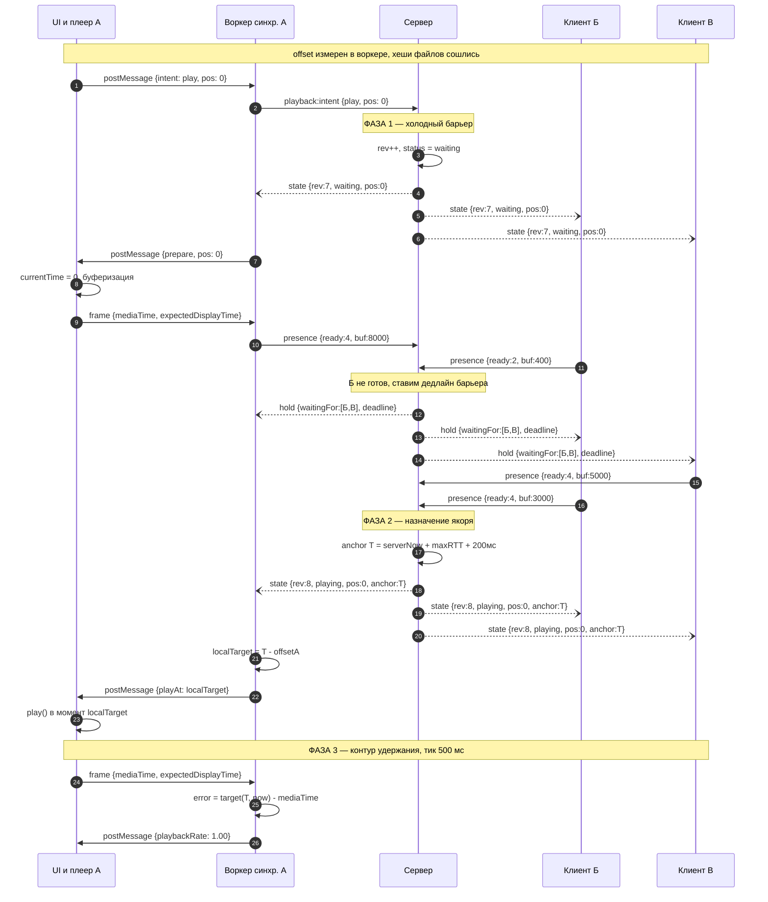

```mermaid
sequenceDiagram
    autonumber
    participant UA as UI и плеер А
    participant WA as Воркер синхр. А
    participant S as Сервер
    participant B as Клиент Б
    participant C as Клиент В
    Note over UA,C: offset измерен в воркере, хеши файлов сошлись
    UA->>WA: postMessage {intent: play, pos: 0}
    WA->>S: playback:intent {play, pos: 0}
    Note over S: ФАЗА 1 — холодный барьер
    S->>S: rev++, status = waiting
    S--)WA: state {rev:7, waiting, pos:0}
    S--)B: state {rev:7, waiting, pos:0}
    S--)C: state {rev:7, waiting, pos:0}
    WA->>UA: postMessage {prepare, pos: 0}
    UA->>UA: currentTime = 0, буферизация
    UA->>WA: frame {mediaTime, expectedDisplayTime}
    WA->>S: presence {ready:4, buf:8000}
    B->>S: presence {ready:2, buf:400}
    Note over S: Б не готов, ставим дедлайн барьера
    S--)WA: hold {waitingFor:[Б,В], deadline}
    S--)B: hold {waitingFor:[Б,В], deadline}
    S--)C: hold {waitingFor:[Б,В], deadline}
    C->>S: presence {ready:4, buf:5000}
    B->>S: presence {ready:4, buf:3000}
    Note over S: ФАЗА 2 — назначение якоря
    S->>S: anchor T = serverNow + maxRTT + 200мс
    S--)WA: state {rev:8, playing, pos:0, anchor:T}
    S--)B: state {rev:8, playing, pos:0, anchor:T}
    S--)C: state {rev:8, playing, pos:0, anchor:T}
    WA->>WA: localTarget = T - offsetA
    WA->>UA: postMessage {playAt: localTarget}
    UA->>UA: play() в момент localTarget
    Note over UA,C: ФАЗА 3 — контур удержания, тик 500 мс
    UA->>WA: frame {mediaTime, expectedDisplayTime}
    WA->>WA: error = target(T, now) - mediaTime
    WA->>UA: postMessage {playbackRate: 1.00}
```
