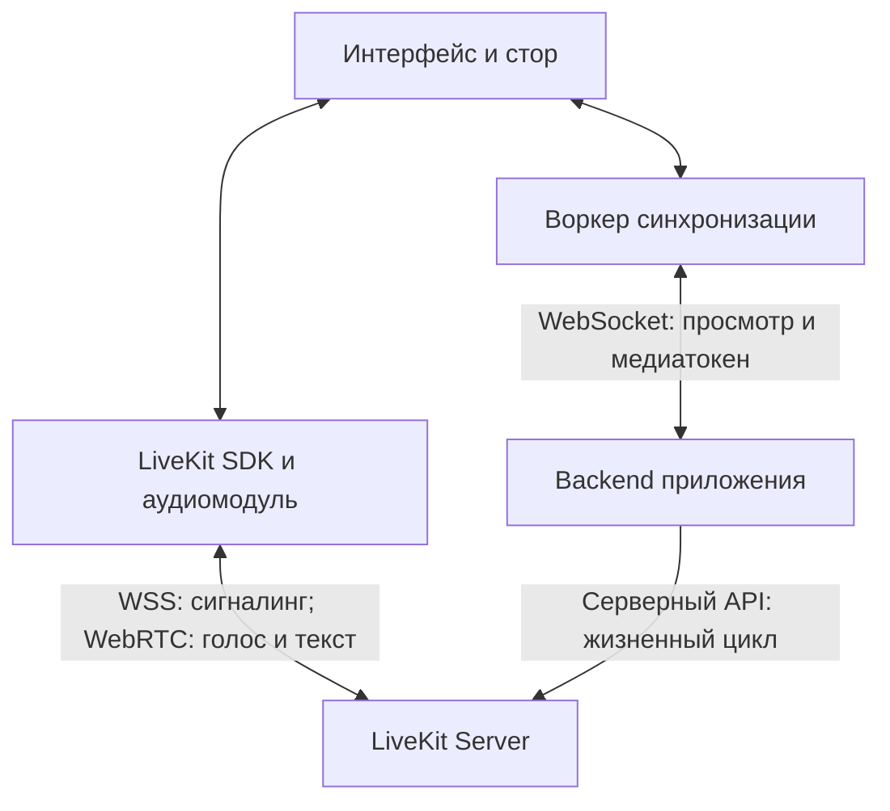
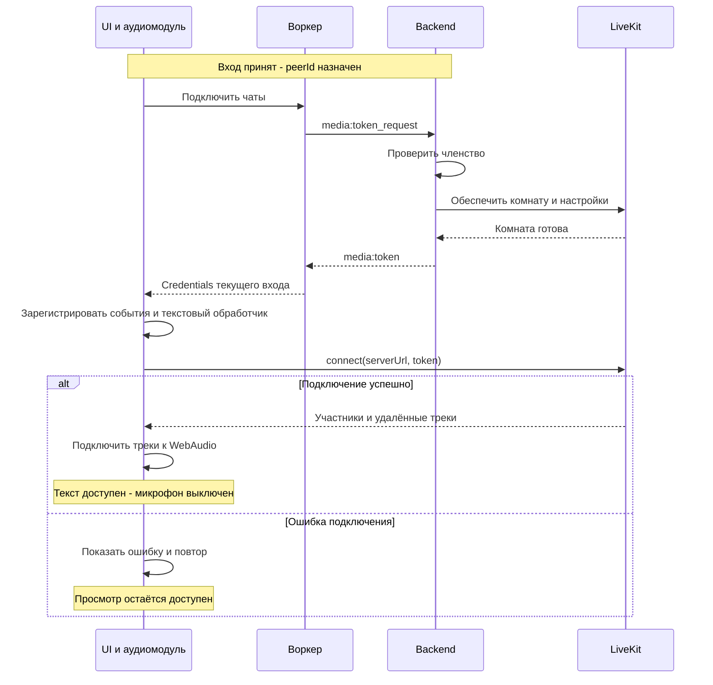
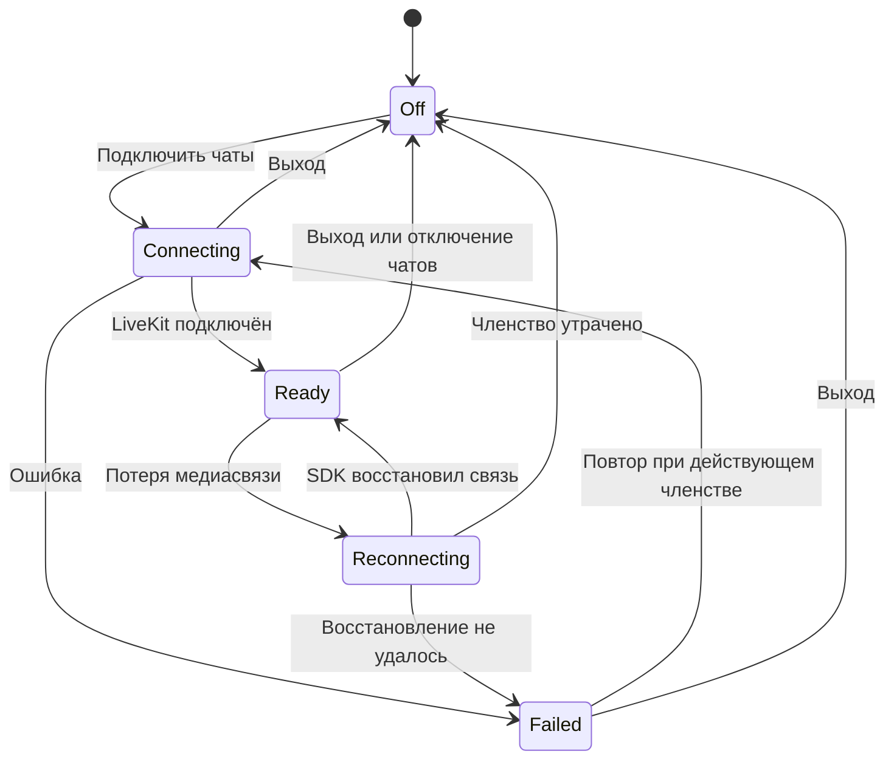
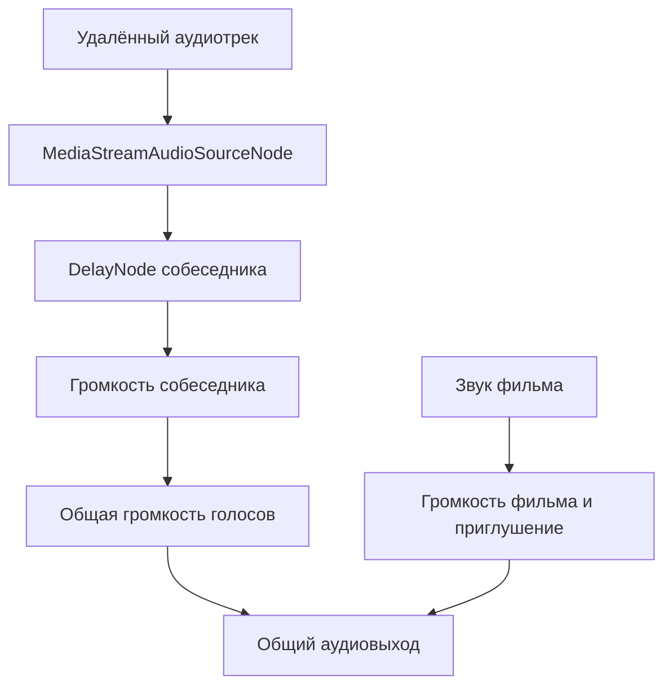
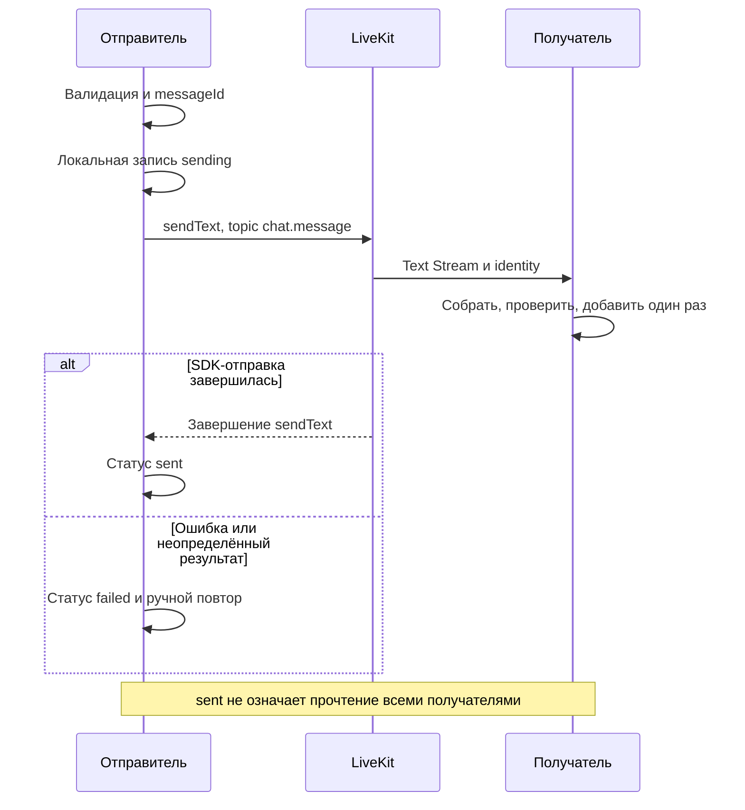

# Голосовой и текстовый чат

Дополнение к документации сервиса совместного просмотра. Документ определяет устройство чатов, обработку звука и контракт подключения к комнате приложения.

## 1. Область документа

Общие правила комнаты, источников видео, калибровки часов, готовности и восстановления позиции здесь не повторяются:

| Документ | Используемый контракт |
|---|---|
| [architecture(2).md](<architecture(2).md>) | Комната и состояние в памяти backend; главный поток и воркеры; WebAudio-микшер; источники видео |
| [protocol(1).md](<protocol(1).md>) | Вход и присутствие участников, `peerId`, состояние воспроизведения, общие ошибки и ограничения |
| [sync-start(2).md](<sync-start(2).md>) | Готовность видео, общий старт и контур удержания позиции |
| [sync_latejoin(2).md](<sync_latejoin(2).md>) | Поздний вход, режим наблюдателя, отклонения участников и восстановление видео |

**В части голоса, текста и аудиообработки настоящий документ является источником правды.** Он заменяет прежние описания голосового mesh, передачи текста через `chat:message` нашего WebSocket и задержки всех голосов по одному отклонению слушателя. Будущая P2P-передача видеофайла остаётся отдельным механизмом общей архитектуры.

Необходимые изменения на границах модулей перечислены в разделе 12. Остальные алгоритмы связанных документов сохраняются.

## 2. Принятые решения

| Часть | Решение |
|---|---|
| Голос | WebRTC через self-hosted LiveKit Server, топология SFU |
| Текст | LiveKit Text Streams поверх WebRTC Data Channels |
| Клиент | `livekit-client` в главном потоке |
| Backend интеграции | `livekit-server-sdk` на существующем Node.js backend |
| Выдача JWT | Через существующий WebSocket после успешного входа |
| Входящий звук | WebAudio: индивидуальная задержка и громкость, общий микшер |
| История | Локальная лента; без серверного хранения и передачи истории новичкам |
| Микрофон при входе | Выключен; публикация после явного действия пользователя |
| Вместимость MVP | Максимум 4 участника; один участник может ждать остальных |

SFU пересылает отдельные аудиопотоки и не смешивает их. Клиент публикует один микрофонный трек и получает до трёх удалённых в пределах MVP. Декодирование и сведение выполняются на клиенте. Увеличение вместимости требует отдельной проверки ресурсов.

Подключение SDK к комнате не означает ровно один `RTCPeerConnection`: LiveKit может использовать отдельные соединения для публикации и получения. Его сигналинг идёт через собственное WSS-соединение. Наш WebSocket голосовой SDP/ICE не ретранслирует.

Фильм в LiveKit не публикуется. Источники видеоданных и видеосинхронизация описаны в связанных документах.

## 3. Комната и участники

### 3.1. Источники состояния

Главной является комната приложения. Вход в неё — предусловие подключения к LiveKit. Медиакомната обслуживает текущую сессию приложения и не является альтернативным способом входа.

| Состояние | Источник правды |
|---|---|
| Членство, имя и разрешение подключиться | Backend приложения |
| Реальное медиаподключение, треки и mute микрофона | LiveKit и события SDK |
| Позиция и состояние просмотра | Существующий движок и протокол синхронизации |
| Громкость, отключение входящего звука, дополнительная задержка | Аудиомодуль конкретного клиента |

Список пользователей строится по участникам приложения. Медиастатусы добавляются по LiveKit identity. При ошибке LiveKit участник остаётся в списке приложения. Неизвестное приложению медиаподключение не создаёт нового пользователя; его голос и текст не подключаются к UI.

### 3.2. Идентификаторы

| Поле               | Правило                                                                      |
| ------------------ | ---------------------------------------------------------------------------- |
| `roomId`           | Существующий идентификатор комнаты приложения                                |
| `roomSessionId`    | Backend назначает случайный ID при создании экземпляра комнаты               |
| `livekitRoomName`  | Backend формирует из `roomId` и `roomSessionId` и хранит в состоянии комнаты |
| `peerId`           | Назначается backend при успешном входе                                       |
| LiveKit `identity` | Равна `peerId`                                                               |
| Отображаемое имя   | Принятое backend имя участника                                               |

Новая сессия по прежней ссылке получает другое имя LiveKit-комнаты. Клиент не выбирает room name и identity при запросе токена.

Новая вкладка или полная перезагрузка проходит новый вход и получает новый `peerId`. Краткое восстановление WebSocket сохраняет его только при восстановлении той же backend-сессии. `peerId` не является секретом или доказательством доступа. Два действующих подключения с одной LiveKit identity не допускаются.

## 4. Выдача токена

### 4.1. Расширение существующего WebSocket

UI обращается к воркеру через стор, воркер передаёт запрос по уже установленному WebSocket. Результат возвращается по тому же пути. Общая организация клиента определена в `architecture(2).md`.

| Сообщение | Направление | Поля |
|---|---|---|
| `media:token_request` | Клиент → backend | `requestId` |
| `media:token` | Backend → запросивший клиент | `requestId`, `serverUrl`, `token`, `expiresAt`, `roomSessionId`, `peerId` |
| Ошибка медиазапроса | Backend → запросивший клиент | `requestId`, `code`, безопасное описание; оболочка согласуется с общими ошибками |

`requestId` уникален в пределах входа. `serverUrl` — WSS URL LiveKit. `expiresAt` — миллисекунды Unix epoch, не шкала видеосинхронизации. JWT не попадает в общий снапшот, состояние других участников или журналы.

Backend берёт комнату, identity и имя из сессии отправившего соединения. Проверяет членство, состояние закрытия и частоту запросов; после обращения к LiveKit повторно проверяет актуальность сессии перед ответом. До успешного входа и после окончательного выхода токен не выдаётся.

Клиент принимает только ответ актуального запроса для текущего входа. Поздний ответ после выхода или смены комнаты игнорируется.

### 4.2. Права JWT

API secret хранится только на backend. В токене разрешены:

- `roomJoin` только для связанной LiveKit-комнаты;
- `canPublish` с `canPublishSources: [microphone]`;
- `canSubscribe`;
- `canPublishData`.

Административные права, камера, демонстрация экрана и запись не выдаются. Первоначальный TTL — 60 секунд, конфигурируемый параметр. Истечение JWT не отключает установленное соединение. Автовосстановление обслуживает SDK; при новом подключении, требующем свежих credentials, запрос повторяется через действующий WebSocket. Периодического переподключения ради TTL нет.

### 4.3. Ошибки

| Код расширения | Действие |
|---|---|
| `not_joined` | Нет действующего членства; подключение не начинается |
| `room_closed` | Сессия закрыта; попытки для неё прекращаются |
| `rate_limited` | Повтор после указанного сервером срока |
| `media_unavailable` | Просмотр доступен; чаты можно подключить повторно |

Ошибки общего входа, включая `room_full`, определены в `protocol(1).md`. Медиазапрос не создаёт дополнительного места в комнате.

## 5. Жизненный цикл медиакомнаты

При первом медиазапросе backend обеспечивает LiveKit-комнату через серверный SDK, задавая `maxParticipants: 4` и таймауты пустой комнаты. Одновременные запросы объединяются в одну операцию для текущего `roomSessionId`. Повторы не генерируют новое имя.

LiveKit может закрыть пустую комнату и позднее создать её автоматически при подключении. Поэтому согласованные настройки должны действовать при каждом создании: через единый серверный конфиг либо поддерживаемую конфигурацию комнаты в join-токене, совпадающую с настройками `CreateRoom`. Наличие комнаты один раз не означает её непрерывного существования.

| Событие | Действие интеграции |
|---|---|
| Первый медиазапрос | Обеспечить комнату и выдать токен |
| Микрофон выключен | Сохранить подключение для текста и прослушивания |
| Участник отключил чаты | Отключить его SDK; членство приложения сохранить |
| Backend окончательно удалил участника | Прекратить выдачу токенов, удалить участника из LiveKit |
| Комната приложения закрыта | Прекратить выдачу токенов и удалить LiveKit-комнату |
| LiveKit закрыл пустую комнату | Сохранить комнату приложения; следующий запрос обеспечивает медиакомнату с тем же текущим именем |

Короткий обрыв WebSocket использует существующую политику восстановления членства. Чаты не вводят конкурирующий таймаут удаления. При окончательной утрате членства клиент отключает LiveKit; сервер очищает подключение независимо от корректности клиентского выхода. Неудачные серверные операции удаления повторяются.

Для MVP один backend владеет выделенным пространством имён LiveKit-комнат. После перезапуска он очищает оставшиеся комнаты своего приложения до выдачи новых медиатокенов, не затрагивая другие приложения. При ошибке очистки новые токены не выдаются до успешного повтора. Штатное завершение также запускает очистку. Новый экземпляр комнаты получает новый `roomSessionId`.

**Ограничение self-hosted:** удаление участника не отзывает уже выданный JWT. До истечения токена возможно повторное подключение и автоматическое создание ранее удалённой комнаты. Короткий TTL, разные имена новых сессий, отказ в новых credentials и повторная очистка уменьшают последствия, но не дают мгновенного отзыва доступа. Немедленный ban и строгая модерация не входят в MVP.

## 6. Подключение, восстановление и выход

### 6.1. Вход

Создание комнаты приложения и вход выполняются по общему протоколу. Следующий сценарий начинается после принятия участника. Первый медиазапрос обеспечивает новую LiveKit-комнату, последующие используют ту же.

Активация `AudioContext` запускается непосредственно из пользовательского действия при входе. Обработчики SDK регистрируются до `connect`, аудиоцепочки создаются после получения треков. Публикация микрофона выполняется отдельно, когда пользователь его включает.

Подготовка видео из `sync_latejoin(2).md` идёт параллельно медиаподключению. Без файла или при несовпадении отпечатка общение доступно; компенсация голоса по позиции фильма выключена. Готовность LiveKit, микрофона и аудиовыхода не участвует в барьере `sync-start(2).md`.

### 6.2. Разрешения и устройства

Включение микрофона включает разрешение браузера, захват устройства и публикацию через SDK. Подключение к комнате само по себе не включает микрофон. UI показывает его активность после успешного включения.

Отказ в разрешении, отсутствие устройства или ошибка захвата не отключают текст и прослушивание. Показывается причина и возможность повторить действие или выбрать устройство. Восстановление сохраняет выбор mute; выключенный пользователем микрофон автоматически не включается.

LiveKit-соединение, разрешение микрофона и запуск аудиовыхода — независимые состояния. При приостановленном WebAudio показывается «Включить звук», возобновляющее наш `AudioContext`. Захват микрофона может работать при заблокированном локальном воспроизведении.

### 6.3. Сбои и восстановление

Во время восстановления новые отправки текста заблокированы, уже показанная лента сохраняется. SDK восстанавливает транспорт; приложение обновляет статус и создаёт аудиоцепочки только для актуальных треков. Повторные события не создают дубликаты узлов или обработчиков.

| Ситуация | Поведение |
|---|---|
| LiveKit недоступен | Голос и текст недоступны, видео работает; доступен повтор |
| LiveKit восстанавливается | Статус восстановления, отправка текста блокируется |
| WebSocket временно оборвался | Существующие чаты могут работать в период восстановления членства; новые токены не запрашиваются |
| Членство окончательно утрачено | Отключить LiveKit и очистить звук |
| Микрофон запрещён | Текст, прослушивание и просмотр доступны |
| Аудиовыход заблокирован | Действие «Включить звук» |

Потеря только медиасвязи не ставит видео на паузу и не меняет состояние комнаты.

### 6.4. Выход и смена комнаты

Клиент отменяет незавершённые запросы, останавливает захват микрофона и отключает LiveKit. Удаляет обработчики, аудиоисточники и задержанные буферы; при выходе очищает ленту. Общий `AudioContext` не закрывается, если он ещё нужен плееру.

Поздние события старого входа игнорируются. Серверная очистка выполняется по разделу 5. Закрытие вкладки не гарантирует доставку сообщения о выходе; действует существующий механизм обнаружения разрыва соединения backend.

## 7. Обработка звука

### 7.1. Аудиограф

Микрофон публикуется отдельно от локального микшера. В отправляемый трек не добавляются фильм и голоса собеседников. Запрашиваются доступные браузерные `echoCancellation`, `noiseSuppression` и `autoGainControl`; их результат зависит от браузера и устройства.

Каждый удалённый трек подключается как источник отдельного `MediaStream` в WebAudio. Ветка фильма использует существующий микшер из `architecture(2).md`.

У каждого удалённого трека ровно один слышимый путь. Одновременное воспроизведение через аудиоэлемент/`track.attach()` и наш граф запрещено. Собственный микрофон в динамики не выводится. После удаления или замены трека прежняя цепочка отключается.

### 7.2. Управление

| Действие | Результат |
|---|---|
| Выключить свой микрофон | Прекратить передачу своего голоса; текст и приём сохранить |
| Изменить громкость участника | Изменить только его локальный gain |
| Отключить входящие голоса | Изменить общий локальный gain; свой микрофон не отключать |
| Выбрать микрофон | Переключить устройство через SDK |
| Изменить громкость фильма | Изменить базовый уровень его ветки |

### 7.3. Приглушение фильма

Аудиомодуль обнаруживает речь и уменьшает звук фильма относительно выбранного пользователем уровня. Удалённая речь анализируется после её индивидуальной задержки. Локальный микрофон анализируется без вывода в динамики. Локально отключённые удалённые голоса не вызывают приглушение фильма.

Фактический gain фильма равен базовой громкости, умноженной на коэффициент приглушения. Базовая настройка пользователя не перезаписывается. Gain изменяется плавно; после окончания речи предусмотрена выдержка против дребезга. Индикатор говорящего может использовать события SDK, но для приглушения важна активность слышимого после задержки сигнала.

Порог активности, коэффициент приглушения и длительности переходов уточняются проверкой на слух.

### 7.4. Источник фильма

Подключение плеера к WebAudio учитывает ограничения источника. Для внешнего URL нужен корректный CORS; без него аудиовыход через `MediaElementAudioSourceNode` может быть недоступен. Это относится к ветке фильма, а не WebRTC-голосу. Требование передаётся модулю плеера; способы получения видео здесь не переопределяются.

## 8. Голос при расхождении видео

### 8.1. Входной контракт

Позицию восстанавливает существующий видеодвижок. Аудиомодуль не перематывает видео, не меняет барьер и не отправляет `playback:intent`. Задержка временно уменьшает вероятность услышать реакцию на ещё не показанный эпизод.

Для локального и удалённых участников стор предоставляет:

| Значение | Требование |
|---|---|
| `peerId` | Сопоставление с LiveKit identity |
| Позиция или отклонение | Миллисекунды, с явно определённым знаком |
| Момент измерения | Приводимый к существующей общей серверной шкале |
| Контекст | Тот же источник видео и актуальная ревизия состояния |
| Готовность | Есть ли видео, идёт ли перемотка или буферизация |

Это расширение существующего `presence:sync`. Повторная передача позиций через LiveKit не нужна. Данные разных источников, старых ревизий и неизвестной свежести не сравниваются. На паузе и при буферизации позиция не экстраполируется как свободно играющая.

### 8.2. Индивидуальная оценка

Позиции приводятся к одному моменту времени. Для собеседника `j`:

`gapMs[j] = remotePositionMs[j] − localPositionMs`

Положительное значение означает, что собеседник смотрит впереди слушателя. При умеренной разнице дополнительная задержка приблизительно равна `gapMs[j] / 1000` секунд. Если используем `driftMs = positionMs − targetMs`, та же разность равна `remoteDriftMs[j] − localDriftMs`.

При отставании слушателя на секунду голос синхронного собеседника можно задержать примерно на секунду. Голос другого собеседника, отставшего на ту же секунду, задерживать не нужно. Это приблизительная компенсация: она не вычитает точно сетевую задержку и не гарантирует совпадения реакции с кадром.

### 8.3. Правила

| Условие | Действие |
|---|---|
| Разница до 250 мс включительно или собеседник позади | Дополнительная задержка нулевая |
| Разница выше порога, но ниже верхней границы | Ограниченная индивидуальная задержка |
| Разрыв выше верхней границы | Вернуть дополнительную задержку к нулю; использовать статус восстановления видеодвижка |
| Нет видео, контекст неизвестен или измерения устарели | Компенсация выключена; разговор продолжается |
| Общая перемотка или смена источника/ревизии | Сбросить старую компенсацию; пересчитать по свежим данным |
| Позиции сошлись | Вернуть задержку к нулю |

250 мс — исходный параметр связанных документов, а не универсальный доказанный порог восприятия. Нужны выдержка или гистерезис для предотвращения частых переключений. Верхняя граница и допустимый возраст измерений уточняются замерами.

`DelayNode` создаётся с явным максимумом, предварительно 5 секунд; рабочий верхний порог не превышает этот максимум. Изменение `delayTime` через `AudioParam` проверяется на артефакты. После общей перемотки накопленные реакции прежнего эпизода не воспроизводятся: прежнюю задерживающую ветку отсоединяют и создают новую, согласуя переход с gain.

Голос автоматически не выключается из-за отставания. Восстановление видео запускается независимо от задержки звука. Раздел уточняет голосовую политику `sync_latejoin(2).md` и заменяет противоречащие ей варианты отключения голоса в других документах.

## 9. Текстовый чат

### 9.1. Сообщение и передача

Используется topic `chat.message`. Обработчик регистрируется до `connect`. Один вызов отправки представляет одно сообщение. Получатель собирает поток целиком и добавляет запись только после успешного завершения. Незавершённый поток не показывается как полноценное сообщение.

| Значение | Источник |
|---|---|
| `messageId` | UUID отправителя в атрибутах потока |
| Текст | Строка Text Stream |
| Отправитель | Identity из контекста SDK, сопоставленная с текущим `peerId` |
| Время | Timestamp потока, только подсказка для UI |
| `positionMs`, необязательно | Локальная позиция фильма при отправке |
| `sourceId`, необязательно | Тот же идентификатор источника из контракта просмотра |

Атрибуты — строки; позиция сериализуется, валидируется и преобразуется получателем. Автор не определяется полем имени внутри payload. Позиция и источник не являются авторитетным состоянием просмотра.

Опциональные поля сохраняют задел общего протокола; кликабельные таймкоды и реакции в MVP не реализуются. Без источника сообщение отправляется без них.

### 9.2. История и порядок

Локальная лента хранит последние 500 сообщений текущей сессии в памяти клиента. Новичок получает новые сообщения после подключения; потоки, начатые до его входа, не доставляются. История с backend или от других участников не запрашивается.

Лента сохраняется при кратком восстановлении, очищается после перезагрузки страницы и выхода. Уход автора не удаляет прежние сообщения: запись хранит снимок имени на момент приёма. Постоянное браузерное хранилище не используется.

Лента следует локальному порядку добавления. Timestamp не задаёт доверенный общий порядок сообщений разных отправителей. Строгая общая последовательность и подтверждение прочтения не реализуются.

### 9.3. Доставка и повтор

Собственная запись создаётся один раз со статусом `sending`. Завершение SDK-отправки даёт `sent`, отказ — `failed`. При разрыве результат может быть неопределённым: часть участников могла получить сообщение.

Автоматического повтора нет. Ручной повтор сохраняет `messageId`; получатели подавляют дубликаты по `(senderIdentity, messageId)` в ограниченном локальном кеше. Это не гарантия exactly-once и не восстановление истории. Нельзя показать вторую копию собственной записи при локальном событии SDK.

Полное переподключение может оборвать чтение потока. Пропущенные во время отключения сообщения не восстанавливаются. Ошибки чтения перехватываются, без необработанных promise rejection.

### 9.4. Ограничения и безопасное отображение

- Не более 2000 символов Unicode и 8 КиБ текста UTF-8; размер атрибутов ограничивается отдельно. Отправка и приём проверяют ограничения.
- Вывод через текстовые узлы, без выполнения HTML, скриптов и пользовательской Markdown-разметки.
- Предварительный ограничитель штатного клиента — одно сообщение в секунду, без накопления автоматической очереди.
- Ограничены одновременно читаемые потоки, входной буфер и время незавершённого чтения; при превышении сообщение отвергается.
- Во время восстановления отправка заблокирована; черновик сохраняется до выхода.

Клиентские ограничения защищают UI и обычный клиент, но не обеспечивают строгую серверную защиту от намеренного спама. Текст обходит наш backend, поэтому старое ограничение `chat:message` к нему не применяется. Строгая модерация и глобальное ограничение требуют отдельного механизма и не заявляются как реализованные.

## 10. Развёртывание и диагностика

LiveKit Server добавляется как отдельный сервис. Для внешнего доступа нужны доверенный TLS-сертификат, WSS endpoint, корректный публичный адрес и открытые медиа-порты. HTTPS сайта требуется для браузерного захвата микрофона вне локальной разработки.

Используется встроенный TURN LiveKit, явно включённый и настроенный; это не встроенный coturn. Настраиваются прямые UDP/TCP-пути и TURN/TLS для сетей с ограничениями. TURN повышает доступность, но не гарантирует соединение в любой сети. Домены, сертификаты и порты фиксируются в конфигурации по официальной документации.

Для MVP достаточно одного LiveKit Server. Версии сервера и SDK закрепляются и проверяются совместно, включая Text Streams. Распределённое развёртывание не входит в этот документ.

Диагностика фиксирует типы ошибок, длительность подключения/восстановления, ошибки устройств и дополнительную задержку. API secret, JWT и содержимое сообщений не логируются. Запись голоса отключена. Транспортное шифрование не называется сквозным E2EE.

## 11. Параметры и приёмка

| Параметр | Значение или статус |
|---|---|
| Участники | Максимум 4 |
| Начальный микрофон | Выключен |
| TTL первоначального JWT | 60 секунд |
| Лента | Последние 500 сообщений |
| Текст | 2000 символов Unicode и 8 КиБ UTF-8 |
| Частота штатной отправки | Предварительно 1 сообщение/секунду |
| Начальный порог компенсации | 250 мс |
| Максимум создаваемого DelayNode | Предварительно 5 секунд |
| Таймауты медиакомнаты | Согласованная конфигурация каждого создания |
| Верхний порог, гистерезис, свежесть позиций | Замеры до включения компенсации в релиз |
| Приглушение фильма | Настройка и проверка на слух |

Предварительные аудиопараметры не являются гарантиями восприятия. При ненадёжных измерениях или непроверенной настройке компенсация выключена, общение продолжает работать с обычной сетевой задержкой.

Приёмка проверяет:

1. Первый и последующие входы, четыре участника, отказ пятому и единое сопоставление `peerId`.
2. Вход без файла, запрет/отсутствие микрофона и блокировку аудиовыхода без потери доступных функций.
3. Раздельные обрывы LiveKit и нашего WebSocket, восстановление и окончательную утрату членства.
4. Повторные события, смену комнаты и поздние токены без двойного звука или лишних обработчиков.
5. Перезагрузку и две вкладки без случайного переиспользования identity.
6. Выход, закрытие комнаты, перезапуск backend и повтор очистки после ошибки.
7. Поздний вход, ошибку чтения/отправки, ручной повтор и переполнение ленты.
8. Безопасный вывод HTML-подобного текста и отказ oversized сообщениям.
9. Индивидуальную громкость, отключение голосов и возвращение базовой громкости фильма после разговора.
10. Одинаковое/различное отставание, старые позиции, паузу и перемотку без устаревшей компенсации и прежних реакций.
11. Подключение напрямую и через настроенный TURN на заявленных браузерах и устройствах.

## 12. Изменения на границах общей документации

Перечень задаёт необходимые правки интеграции и не повторяет общие алгоритмы.

| Материал/модуль | Изменение |
|---|---|
| `architecture(2).md` | Добавить LiveKit и связь с backend; заменить прямой голос на SFU; подключить треки к микшеру; тезис об отсутствии медиасервера ограничить видеоконтентом |
| `protocol(1).md` | Добавить медиатокены и ошибки; возвращать собственный назначенный `peerId` при входе; исключить текст из WS `chat:message` |
| Сигналинг | Голос обслуживает LiveKit; сохранить отдельную область будущей P2P-передачи файла |
| Комната backend | Добавить `roomSessionId`, имя медиакомнаты и серверные операции жизненного цикла |
| `presence:sync` и стор | Предоставить сопоставленные по `peerId` свежие позиции/отклонения с временем и контекстом |
| `sync-start(2).md` | Готовность чатов не блокирует старт; голосовая политика определяется здесь |
| `sync_latejoin(2).md` | Чаты подключаются параллельно подготовке видео; задержка индивидуальна по разделу 8 |
| Вместимость | Сохранить лимит 4, убрать обоснование mesh-топологией голоса |

## 13. Технические источники

Источники подтверждают механизмы платформы и браузера. Параметры и политика приложения определяются настоящим документом.

- [LiveKit: клиентский протокол и сигналинг](https://docs.livekit.io/reference/internals/client-protocol/).
- [LiveKit: подключение, identity и восстановление](https://docs.livekit.io/intro/basics/connect/).
- [LiveKit: JWT, права и ограничения отзыва self-hosted](https://docs.livekit.io/frontends/reference/tokens-grants/).
- [LiveKit: комнаты, настройки и удаление участников](https://docs.livekit.io/reference/other/roomservice-api/).
- [LiveKit: Text Streams, ошибки и отсутствие истории](https://docs.livekit.io/transport/data/text-streams/).
- [LiveKit: публикация микрофона](https://docs.livekit.io/transport/media/publish/).
- [LiveKit: развёртывание и встроенный TURN](https://docs.livekit.io/transport/self-hosting/deployment/).
- [MDN: MediaStreamAudioSourceNode](https://developer.mozilla.org/en-US/docs/Web/API/MediaStreamAudioSourceNode).
- [MDN: DelayNode](https://developer.mozilla.org/en-US/docs/Web/API/DelayNode).
- [MDN: MediaElementAudioSourceNode](https://developer.mozilla.org/en-US/docs/Web/API/MediaElementAudioSourceNode).
